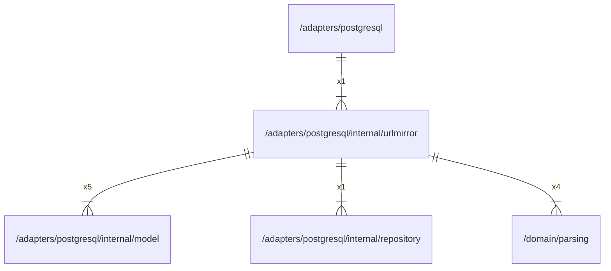

# urlmirror

## Imports

### Inner imports

| Name       | Path                                                      | Count |
|:-----------|:----------------------------------------------------------|------:|
| model      | [/adapters/postgresql/internal/model](model.md)           |     5 |
| parsing    | [/domain/parsing](../../../domain/parsing.md)             |     4 |
| repository | [/adapters/postgresql/internal/repository](repository.md) |     1 |

### External imports

| Name     | Path                            | Count |
|:---------|:--------------------------------|------:|
| squirrel | github.com/Masterminds/squirrel |     5 |
| uuid     | github.com/google/uuid          |     2 |

### Std imports

| Name    | Path    | Count |
|:--------|:--------|------:|
| context | context |     5 |
| fmt     | fmt     |     5 |

## Used by

| Name       | Path                                        |
|:-----------|:--------------------------------------------|
| postgresql | [/adapters/postgresql](../../postgresql.md) |

## Scheme

---

> Generated by [goArchLint](https://github.com/gbh007/goarchlint)
