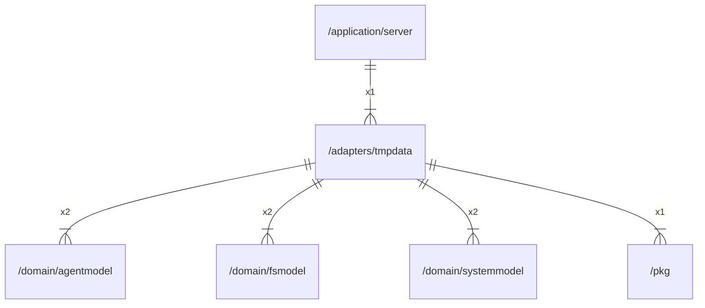

# tmpdata

## Imports

|    Name     |                      Path                       | Inner | Count |
|:-----------:|:-----------------------------------------------:|:-----:|:-----:|
| agentmodel  |  [/domain/agentmodel](../domain/agentmodel.md)  |  ✅   |   2   |
|   fsmodel   |     [/domain/fsmodel](../domain/fsmodel.md)     |  ✅   |   2   |
| systemmodel | [/domain/systemmodel](../domain/systemmodel.md) |  ✅   |   2   |
|    uuid     |             github.com/google/uuid              |  ❌   |   2   |
|     pkg     |                [/pkg](../pkg.md)                |  ✅   |   1   |
|    sync     |                      sync                       |  ❌   |   1   |

## Used by

|  Name  |                      Path                       |
|:------:|:-----------------------------------------------:|
| server | [/application/server](../application/server.md) |

## Scheme

---

> Generated by [goArchLint](https://github.com/gbh007/goarchlint)
