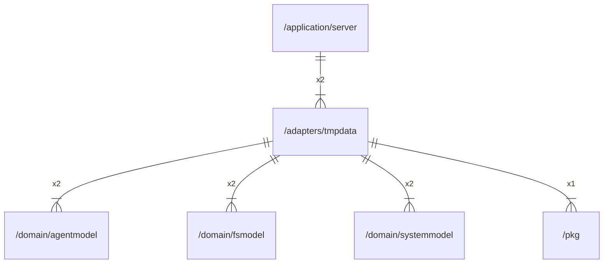

# tmpdata

## Imports

### Inner imports

| Name        | Path                                            | Count |
|:------------|:------------------------------------------------|------:|
| agentmodel  | [/domain/agentmodel](../domain/agentmodel.md)   |     2 |
| fsmodel     | [/domain/fsmodel](../domain/fsmodel.md)         |     2 |
| systemmodel | [/domain/systemmodel](../domain/systemmodel.md) |     2 |
| pkg         | [/pkg](../pkg.md)                               |     1 |

### External imports

| Name | Path                   | Count |
|:-----|:-----------------------|------:|
| uuid | github.com/google/uuid |     2 |

### Std imports

| Name | Path | Count |
|:-----|:-----|------:|
| sync | sync |     1 |

## Used by

| Name   | Path                                            |
|:-------|:------------------------------------------------|
| server | [/application/server](../application/server.md) |

## Scheme

```mermaid
erDiagram
    "/adapters/tmpdata" ||--|{ "/domain/agentmodel" : x2
    "/adapters/tmpdata" ||--|{ "/domain/fsmodel" : x2
    "/adapters/tmpdata" ||--|{ "/domain/systemmodel" : x2
    "/adapters/tmpdata" ||--|{ "/pkg" : x1
    "/application/server" ||--|{ "/adapters/tmpdata" : x2
```

---

> Generated by [goArchLint](https://github.com/gbh007/goarchlint)
