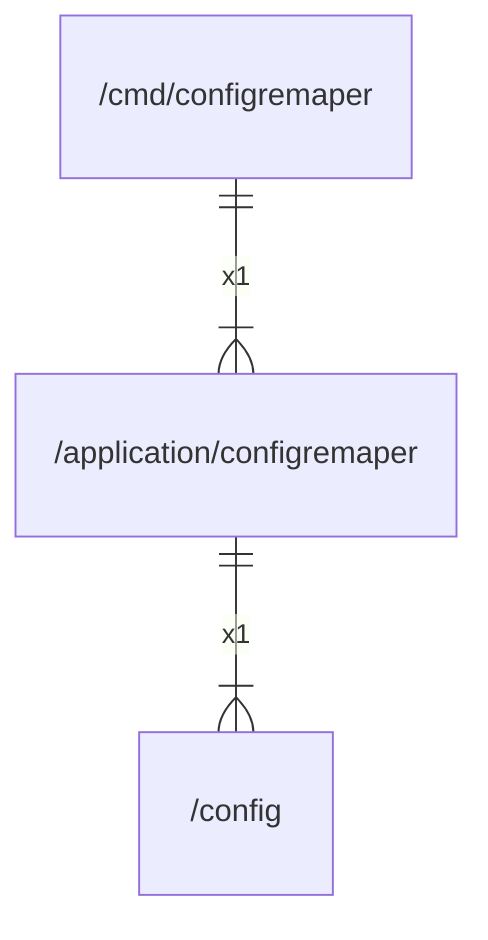

# configremaper

## Imports

|  Name  |          Path           | Inner | Count |
|:------:|:-----------------------:|:-----:|:-----:|
|  flag  |          flag           |  ❌   |   1   |
| config | [/config](../config.md) |  ✅   |   1   |
|  slog  |        log/slog         |  ❌   |   1   |
|   os   |           os            |  ❌   |   1   |

## Used by

|     Name      |                     Path                      |
|:-------------:|:---------------------------------------------:|
| configremaper | [/cmd/configremaper](../cmd/configremaper.md) |

## Scheme

---

> Generated by [goArchLint](https://github.com/gbh007/goarchlint)
