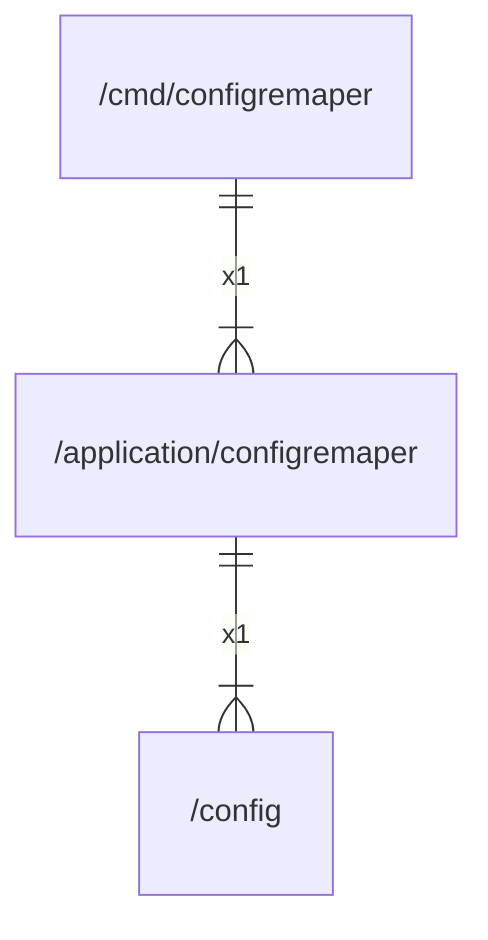

# configremaper

## Imports

### Inner imports

| Name   | Path                    | Count |
|:-------|:------------------------|------:|
| config | [/config](../config.md) |     1 |

### Std imports

| Name | Path     | Count |
|:-----|:---------|------:|
| flag | flag     |     1 |
| slog | log/slog |     1 |
| os   | os       |     1 |

## Used by

| Name          | Path                                          |
|:--------------|:----------------------------------------------|
| configremaper | [/cmd/configremaper](../cmd/configremaper.md) |

## Scheme

```mermaid
erDiagram
    "/application/configremaper" ||--|{ "/config" : x1
    "/cmd/configremaper" ||--|{ "/application/configremaper" : x1
```

---

> Generated by [goArchLint](https://github.com/gbh007/goarchlint)
