# server

## Imports

|        Name         |                                Path                                 | Inner | Count |
|:-------------------:|:-------------------------------------------------------------------:|:-----:|:-----:|
|       context       |                               context                               |  ❌   |   6   |
|         fmt         |                                 fmt                                 |  ❌   |   6   |
|       config        |                       [/config](../config.md)                       |  ✅   |   4   |
|        slog         |                              log/slog                               |  ❌   |   4   |
|    workermanager    |    [/controllers/workermanager](../controllers/workermanager.md)    |  ✅   |   3   |
|        agent        |               [/adapters/agent](../adapters/agent.md)               |  ✅   |   2   |
|     filestorage     |         [/adapters/filestorage](../adapters/filestorage.md)         |  ✅   |   2   |
|       metric        |              [/adapters/metric](../adapters/metric.md)              |  ✅   |   2   |
|     postgresql      |          [/adapters/postgresql](../adapters/postgresql.md)          |  ✅   |   2   |
|       tmpdata       |             [/adapters/tmpdata](../adapters/tmpdata.md)             |  ✅   |   2   |
|        async        |            [/controllers/async](../controllers/async.md)            |  ✅   |   2   |
|    agentusecase     |        [/usecases/agentusecase](../usecases/agentusecase.md)        |  ✅   |   2   |
|  attributeusecase   |    [/usecases/attributeusecase](../usecases/attributeusecase.md)    |  ✅   |   2   |
|     bffusecase      |          [/usecases/bffusecase](../usecases/bffusecase.md)          |  ✅   |   2   |
|     bookusecase     |         [/usecases/bookusecase](../usecases/bookusecase.md)         |  ✅   |   2   |
|   cleanupusecase    |      [/usecases/cleanupusecase](../usecases/cleanupusecase.md)      |  ✅   |   2   |
| deduplicatorusecase | [/usecases/deduplicatorusecase](../usecases/deduplicatorusecase.md) |  ✅   |   2   |
|    exportusecase    |       [/usecases/exportusecase](../usecases/exportusecase.md)       |  ✅   |   2   |
|  filesystemusecase  |   [/usecases/filesystemusecase](../usecases/filesystemusecase.md)   |  ✅   |   2   |
|    hproxyusecase    |       [/usecases/hproxyusecase](../usecases/hproxyusecase.md)       |  ✅   |   2   |
|    labelusecase     |        [/usecases/labelusecase](../usecases/labelusecase.md)        |  ✅   |   2   |
|   massloadusecase   |     [/usecases/massloadusecase](../usecases/massloadusecase.md)     |  ✅   |   2   |
|   parsingusecase    |      [/usecases/parsingusecase](../usecases/parsingusecase.md)      |  ✅   |   2   |
|  rebuilderusecase   |    [/usecases/rebuilderusecase](../usecases/rebuilderusecase.md)    |  ✅   |   2   |
|    systemusecase    |       [/usecases/systemusecase](../usecases/systemusecase.md)       |  ✅   |   2   |
|    pyroscope-go     |                   github.com/grafana/pyroscope-go                   |  ❌   |   2   |
|        otel         |                      go.opentelemetry.io/otel                       |  ❌   |   2   |
|        trace        |                   go.opentelemetry.io/otel/trace                    |  ❌   |   2   |
|         os          |                                 os                                  |  ❌   |   2   |
|        flag         |                                flag                                 |  ❌   |   1   |
|      apiagent       |         [/controllers/apiagent](../controllers/apiagent.md)         |  ✅   |   1   |
|      apiserver      |        [/controllers/apiserver](../controllers/apiserver.md)        |  ✅   |   1   |
|        core         |                  [/domain/core](../domain/core.md)                  |  ✅   |   1   |
|     systemmodel     |           [/domain/systemmodel](../domain/systemmodel.md)           |  ✅   |   1   |
|         pkg         |                          [/pkg](../pkg.md)                          |  ✅   |   1   |
|    otlptracehttp    |   go.opentelemetry.io/otel/exporters/otlp/otlptrace/otlptracehttp   |  ❌   |   1   |
|     propagation     |                go.opentelemetry.io/otel/propagation                 |  ❌   |   1   |
|      resource       |                go.opentelemetry.io/otel/sdk/resource                |  ❌   |   1   |
|        trace        |                 go.opentelemetry.io/otel/sdk/trace                  |  ❌   |   1   |
|       v1.20.0       |              go.opentelemetry.io/otel/semconv/v1.20.0               |  ❌   |   1   |
|        noop         |                 go.opentelemetry.io/otel/trace/noop                 |  ❌   |   1   |
|       runtime       |                               runtime                               |  ❌   |   1   |
|        time         |                                time                                 |  ❌   |   1   |

## Used by

|  Name  |              Path               |
|:------:|:-------------------------------:|
| server | [/cmd/server](../cmd/server.md) |

## Scheme

```mermaid
erDiagram
    "/application/server" ||--|{ "/adapters/agent" : x2
    "/application/server" ||--|{ "/adapters/filestorage" : x2
    "/application/server" ||--|{ "/adapters/metric" : x2
    "/application/server" ||--|{ "/adapters/postgresql" : x2
    "/application/server" ||--|{ "/adapters/tmpdata" : x2
    "/application/server" ||--|{ "/config" : x4
    "/application/server" ||--|{ "/controllers/apiagent" : x1
    "/application/server" ||--|{ "/controllers/apiserver" : x1
    "/application/server" ||--|{ "/controllers/async" : x2
    "/application/server" ||--|{ "/controllers/workermanager" : x3
    "/application/server" ||--|{ "/domain/core" : x1
    "/application/server" ||--|{ "/domain/systemmodel" : x1
    "/application/server" ||--|{ "/pkg" : x1
    "/application/server" ||--|{ "/usecases/agentusecase" : x2
    "/application/server" ||--|{ "/usecases/attributeusecase" : x2
    "/application/server" ||--|{ "/usecases/bffusecase" : x2
    "/application/server" ||--|{ "/usecases/bookusecase" : x2
    "/application/server" ||--|{ "/usecases/cleanupusecase" : x2
    "/application/server" ||--|{ "/usecases/deduplicatorusecase" : x2
    "/application/server" ||--|{ "/usecases/exportusecase" : x2
    "/application/server" ||--|{ "/usecases/filesystemusecase" : x2
    "/application/server" ||--|{ "/usecases/hproxyusecase" : x2
    "/application/server" ||--|{ "/usecases/labelusecase" : x2
    "/application/server" ||--|{ "/usecases/massloadusecase" : x2
    "/application/server" ||--|{ "/usecases/parsingusecase" : x2
    "/application/server" ||--|{ "/usecases/rebuilderusecase" : x2
    "/application/server" ||--|{ "/usecases/systemusecase" : x2
    "/cmd/server" ||--|{ "/application/server" : x1
```

---

> Generated by [goArchLint](https://github.com/gbh007/goarchlint)
