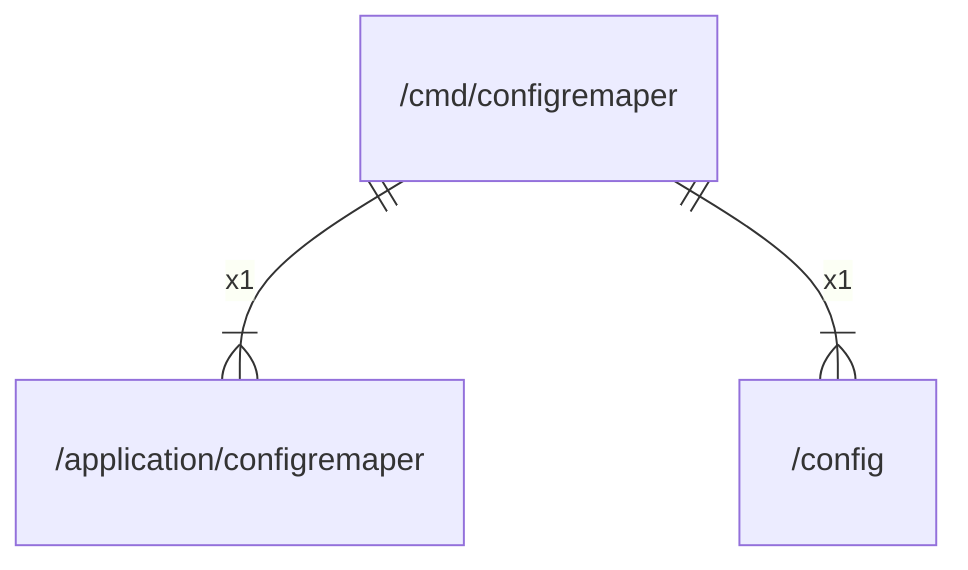

# main

## Imports

|     Name      |                             Path                              | Inner | Count |
|:-------------:|:-------------------------------------------------------------:|:-----:|:-----:|
| configremaper | [/application/configremaper](../application/configremaper.md) |  ✅   |   1   |
|    config     |                    [/config](../config.md)                    |  ✅   |   1   |

## Scheme

---

> Generated by [goArchLint](https://github.com/gbh007/goarchlint)
