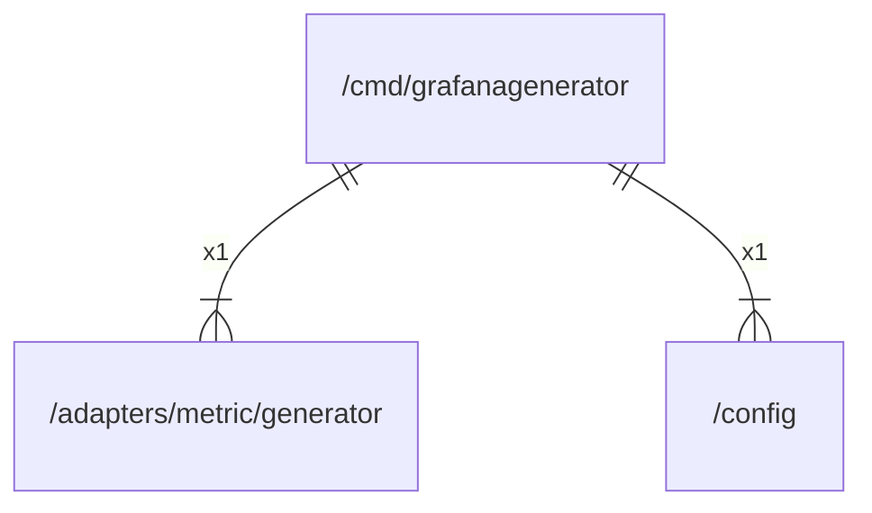

# main

## Imports

|   Name    |                             Path                              | Inner | Count |
|:---------:|:-------------------------------------------------------------:|:-----:|:-----:|
|   json    |                         encoding/json                         |  ❌   |   1   |
|   flag    |                             flag                              |  ❌   |   1   |
| generator | [/adapters/metric/generator](../adapters/metric/generator.md) |  ✅   |   1   |
|  config   |                    [/config](../config.md)                    |  ✅   |   1   |
|  strfmt   |                 github.com/go-openapi/strfmt                  |  ❌   |   1   |
|  client   |      github.com/grafana/grafana-openapi-client-go/client      |  ❌   |   1   |
|  models   |      github.com/grafana/grafana-openapi-client-go/models      |  ❌   |   1   |
|    url    |                            net/url                            |  ❌   |   1   |
|    os     |                              os                               |  ❌   |   1   |

## Scheme

---

> Generated by [goArchLint](https://github.com/gbh007/goarchlint)
