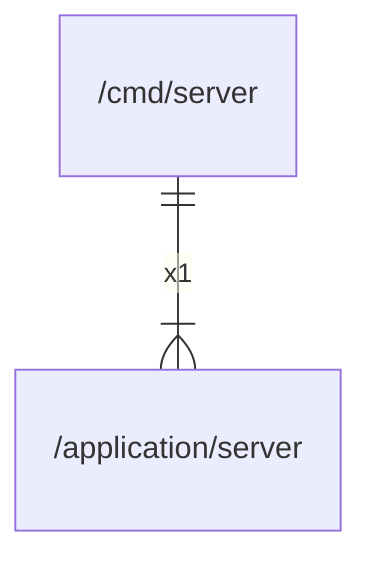

# main

## Imports

|  Name   |                      Path                       | Inner | Count |
|:-------:|:-----------------------------------------------:|:-----:|:-----:|
| context |                     context                     |  ❌   |   1   |
| server  | [/application/server](../application/server.md) |  ✅   |   1   |
|  slog   |                    log/slog                     |  ❌   |   1   |
|   os    |                       os                        |  ❌   |   1   |
| signal  |                    os/signal                    |  ❌   |   1   |
| syscall |                     syscall                     |  ❌   |   1   |

## Scheme

---

> Generated by [goArchLint](https://github.com/gbh007/goarchlint)
