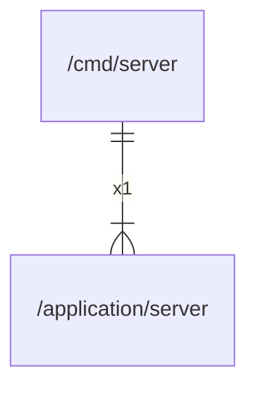

# main

## Imports

|  Name  |                      Path                       | Inner | Count |
|:------:|:-----------------------------------------------:|:-----:|:-----:|
| server | [/application/server](../application/server.md) |  ✅   |   1   |

## Scheme

---

> Generated by [goArchLint](https://github.com/gbh007/goarchlint)
