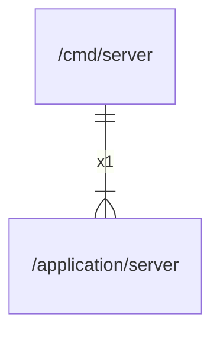

# main

## Imports

### Inner imports

| Name   | Path                                            | Count |
|:-------|:------------------------------------------------|------:|
| server | [/application/server](../application/server.md) |     1 |

### Std imports

| Name    | Path      | Count |
|:--------|:----------|------:|
| context | context   |     1 |
| slog    | log/slog  |     1 |
| os      | os        |     1 |
| signal  | os/signal |     1 |
| syscall | syscall   |     1 |

## Scheme

```mermaid
erDiagram
    "/cmd/server" ||--|{ "/application/server" : x1
```

---

> Generated by [goArchLint](https://github.com/gbh007/goarchlint)
