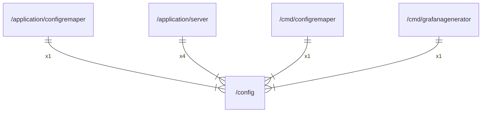

# config

## Imports

|   Name    |                 Path                 | Inner | Count |
|:---------:|:------------------------------------:|:-----:|:-----:|
|   time    |                 time                 |  ❌   |   4   |
|  errors   |                errors                |  ❌   |   2   |
|    fmt    |                 fmt                  |  ❌   |   2   |
|   toml    |      github.com/BurntSushi/toml      |  ❌   |   2   |
| envconfig | github.com/kelseyhightower/envconfig |  ❌   |   2   |
|  yaml.v3  |           gopkg.in/yaml.v3           |  ❌   |   2   |
|    os     |                  os                  |  ❌   |   2   |
|   path    |                 path                 |  ❌   |   2   |
| godotenv  |       github.com/joho/godotenv       |  ❌   |   1   |
|    io     |                  io                  |  ❌   |   1   |
|   slog    |               log/slog               |  ❌   |   1   |
|  strings  |               strings                |  ❌   |   1   |
| template  |            text/template             |  ❌   |   1   |

## Used by

|       Name       |                            Path                            |
|:----------------:|:----------------------------------------------------------:|
|  configremaper   | [/application/configremaper](application/configremaper.md) |
|      server      |        [/application/server](application/server.md)        |
|  configremaper   |         [/cmd/configremaper](cmd/configremaper.md)         |
| grafanagenerator |      [/cmd/grafanagenerator](cmd/grafanagenerator.md)      |

## Scheme

---

> Generated by [goArchLint](https://github.com/gbh007/goarchlint)
