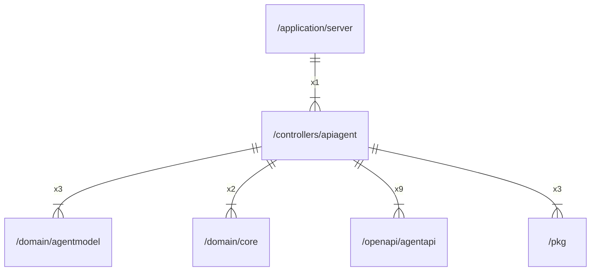

# apiagent

## Imports

|    Name     |                     Path                      | Inner | Count |
|:-----------:|:---------------------------------------------:|:-----:|:-----:|
|   context   |                    context                    |  ❌   |  10   |
|  agentapi   |  [/openapi/agentapi](../openapi/agentapi.md)  |  ✅   |   9   |
|    slog     |                   log/slog                    |  ❌   |   4   |
|   errors    |                    errors                     |  ❌   |   3   |
| agentmodel  | [/domain/agentmodel](../domain/agentmodel.md) |  ✅   |   3   |
|     pkg     |               [/pkg](../pkg.md)               |  ✅   |   3   |
|    http     |                   net/http                    |  ❌   |   3   |
|    time     |                     time                      |  ❌   |   3   |
|    core     |       [/domain/core](../domain/core.md)       |  ✅   |   2   |
|     io      |                      io                       |  ❌   |   2   |
|     url     |                    net/url                    |  ❌   |   2   |
|    bytes    |                     bytes                     |  ❌   |   1   |
|    json     |                 encoding/json                 |  ❌   |   1   |
|     fmt     |                      fmt                      |  ❌   |   1   |
|    uuid     |            github.com/google/uuid             |  ❌   |   1   |
| middleware  |      github.com/ogen-go/ogen/middleware       |  ❌   |   1   |
| ogenerrors  |      github.com/ogen-go/ogen/ogenerrors       |  ❌   |   1   |
|  validate   |       github.com/ogen-go/ogen/validate        |  ❌   |   1   |
|    otel     |           go.opentelemetry.io/otel            |  ❌   |   1   |
| propagation |     go.opentelemetry.io/otel/propagation      |  ❌   |   1   |
|    trace    |        go.opentelemetry.io/otel/trace         |  ❌   |   1   |
|   runtime   |                    runtime                    |  ❌   |   1   |
|   strconv   |                    strconv                    |  ❌   |   1   |
|   strings   |                    strings                    |  ❌   |   1   |

## Used by

|  Name  |                      Path                       |
|:------:|:-----------------------------------------------:|
| server | [/application/server](../application/server.md) |

## Scheme

---

> Generated by [goArchLint](https://github.com/gbh007/goarchlint)
