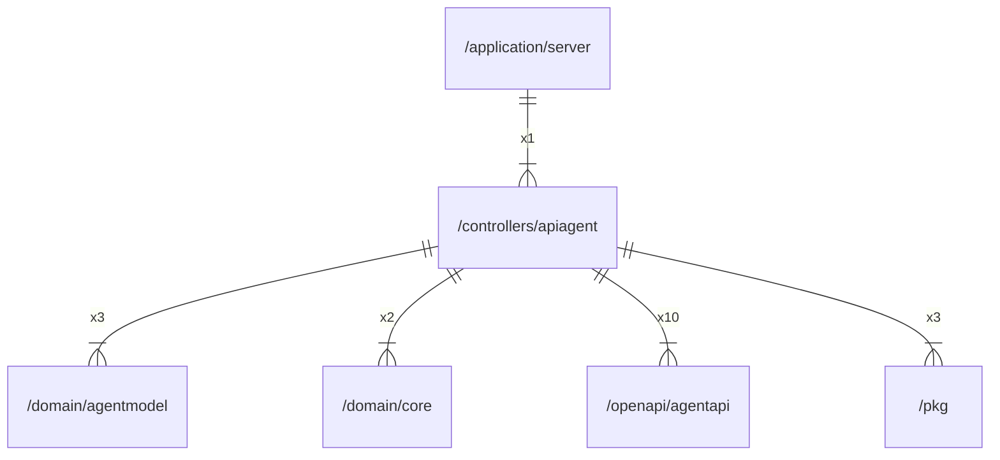

# apiagent

## Imports

### Inner imports

| Name       | Path                                          | Count |
|:-----------|:----------------------------------------------|------:|
| agentapi   | [/openapi/agentapi](../openapi/agentapi.md)   |    10 |
| agentmodel | [/domain/agentmodel](../domain/agentmodel.md) |     3 |
| pkg        | [/pkg](../pkg.md)                             |     3 |
| core       | [/domain/core](../domain/core.md)             |     2 |

### External imports

| Name        | Path                                 | Count |
|:------------|:-------------------------------------|------:|
| ogenerrors  | github.com/ogen-go/ogen/ogenerrors   |     2 |
| validate    | github.com/ogen-go/ogen/validate     |     2 |
| uuid        | github.com/google/uuid               |     1 |
| middleware  | github.com/ogen-go/ogen/middleware   |     1 |
| otel        | go.opentelemetry.io/otel             |     1 |
| propagation | go.opentelemetry.io/otel/propagation |     1 |
| trace       | go.opentelemetry.io/otel/trace       |     1 |

### Std imports

| Name    | Path          | Count |
|:--------|:--------------|------:|
| context | context       |    11 |
| http    | net/http      |     6 |
| errors  | errors        |     4 |
| slog    | log/slog      |     4 |
| time    | time          |     3 |
| bytes   | bytes         |     2 |
| fmt     | fmt           |     2 |
| io      | io            |     2 |
| url     | net/url       |     2 |
| strconv | strconv       |     2 |
| json    | encoding/json |     1 |
| runtime | runtime       |     1 |
| strings | strings       |     1 |

## Used by

| Name   | Path                                            |
|:-------|:------------------------------------------------|
| server | [/application/server](../application/server.md) |

## Scheme

```mermaid
erDiagram
    "/application/server" ||--|{ "/controllers/apiagent" : x1
    "/controllers/apiagent" ||--|{ "/domain/agentmodel" : x3
    "/controllers/apiagent" ||--|{ "/domain/core" : x2
    "/controllers/apiagent" ||--|{ "/openapi/agentapi" : x10
    "/controllers/apiagent" ||--|{ "/pkg" : x3
```

---

> Generated by [goArchLint](https://github.com/gbh007/goarchlint)
