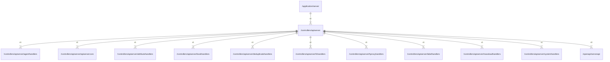

# apiserver

## Imports

|        Name         |                                      Path                                      | Inner | Count |
|:-------------------:|:------------------------------------------------------------------------------:|:-----:|:-----:|
|        slog         |                                    log/slog                                    |  ❌   |   4   |
|        http         |                                    net/http                                    |  ❌   |   4   |
|       context       |                                    context                                     |  ❌   |   3   |
|       errors        |                                     errors                                     |  ❌   |   3   |
|      serverapi      |                 [/openapi/serverapi](../openapi/serverapi.md)                  |  ✅   |   3   |
|        time         |                                      time                                      |  ❌   |   3   |
|         fmt         |                                      fmt                                       |  ❌   |   2   |
|        bytes        |                                     bytes                                      |  ❌   |   1   |
|        json         |                                 encoding/json                                  |  ❌   |   1   |
|    agenthandlers    |       [/controllers/apiserver/agenthandlers](apiserver/agenthandlers.md)       |  ✅   |   1   |
|    apiservercore    |       [/controllers/apiserver/apiservercore](apiserver/apiservercore.md)       |  ✅   |   1   |
|  attributehandlers  |   [/controllers/apiserver/attributehandlers](apiserver/attributehandlers.md)   |  ✅   |   1   |
|    bookhandlers     |        [/controllers/apiserver/bookhandlers](apiserver/bookhandlers.md)        |  ✅   |   1   |
| deduplicatehandlers | [/controllers/apiserver/deduplicatehandlers](apiserver/deduplicatehandlers.md) |  ✅   |   1   |
|     fshandlers      |          [/controllers/apiserver/fshandlers](apiserver/fshandlers.md)          |  ✅   |   1   |
|   hproxyhandlers    |      [/controllers/apiserver/hproxyhandlers](apiserver/hproxyhandlers.md)      |  ✅   |   1   |
|    labelhandlers    |       [/controllers/apiserver/labelhandlers](apiserver/labelhandlers.md)       |  ✅   |   1   |
|  massloadhandlers   |    [/controllers/apiserver/massloadhandlers](apiserver/massloadhandlers.md)    |  ✅   |   1   |
|   systemhandlers    |      [/controllers/apiserver/systemhandlers](apiserver/systemhandlers.md)      |  ✅   |   1   |
|     middleware      |                       github.com/ogen-go/ogen/middleware                       |  ❌   |   1   |
|     ogenerrors      |                       github.com/ogen-go/ogen/ogenerrors                       |  ❌   |   1   |
|      validate       |                        github.com/ogen-go/ogen/validate                        |  ❌   |   1   |
|     prometheus      |                 github.com/prometheus/client_golang/prometheus                 |  ❌   |   1   |
|      promhttp       |            github.com/prometheus/client_golang/prometheus/promhttp             |  ❌   |   1   |
|        otel         |                            go.opentelemetry.io/otel                            |  ❌   |   1   |
|     propagation     |                      go.opentelemetry.io/otel/propagation                      |  ❌   |   1   |
|        trace        |                         go.opentelemetry.io/otel/trace                         |  ❌   |   1   |
|         io          |                                       io                                       |  ❌   |   1   |
|       runtime       |                                    runtime                                     |  ❌   |   1   |
|       strconv       |                                    strconv                                     |  ❌   |   1   |
|       strings       |                                    strings                                     |  ❌   |   1   |

## Used by

|  Name  |                      Path                       |
|:------:|:-----------------------------------------------:|
| server | [/application/server](../application/server.md) |

## Scheme

---

> Generated by [goArchLint](https://github.com/gbh007/goarchlint)
