# apiservercore

## Imports

|   Name    |                       Path                       | Inner | Count |
|:---------:|:------------------------------------------------:|:-----:|:-----:|
|  context  |                     context                      |  ❌   |   3   |
| serverapi | [/openapi/serverapi](../../openapi/serverapi.md) |  ✅   |   3   |
|   uuid    |              github.com/google/uuid              |  ❌   |   3   |
|    url    |                     net/url                      |  ❌   |   3   |
|   core    |       [/domain/core](../../domain/core.md)       |  ✅   |   2   |
|   slog    |                     log/slog                     |  ❌   |   2   |
|   time    |                       time                       |  ❌   |   2   |
|    fmt    |                       fmt                        |  ❌   |   1   |
|    bff    |        [/domain/bff](../../domain/bff.md)        |  ✅   |   1   |
|  fsmodel  |    [/domain/fsmodel](../../domain/fsmodel.md)    |  ✅   |   1   |
|    pkg    |               [/pkg](../../pkg.md)               |  ✅   |   1   |
|   trace   |          go.opentelemetry.io/otel/trace          |  ❌   |   1   |

## Used by

|        Name         |                                 Path                                 |
|:-------------------:|:--------------------------------------------------------------------:|
|      apiserver      |              [/controllers/apiserver](../apiserver.md)               |
|    agenthandlers    |       [/controllers/apiserver/agenthandlers](agenthandlers.md)       |
|  attributehandlers  |   [/controllers/apiserver/attributehandlers](attributehandlers.md)   |
|    bookhandlers     |        [/controllers/apiserver/bookhandlers](bookhandlers.md)        |
| deduplicatehandlers | [/controllers/apiserver/deduplicatehandlers](deduplicatehandlers.md) |
|     fshandlers      |          [/controllers/apiserver/fshandlers](fshandlers.md)          |
|   hproxyhandlers    |      [/controllers/apiserver/hproxyhandlers](hproxyhandlers.md)      |
|    labelhandlers    |       [/controllers/apiserver/labelhandlers](labelhandlers.md)       |
|  massloadhandlers   |    [/controllers/apiserver/massloadhandlers](massloadhandlers.md)    |
|   systemhandlers    |      [/controllers/apiserver/systemhandlers](systemhandlers.md)      |

## Scheme

```mermaid
erDiagram
    "/controllers/apiserver" ||--|{ "/controllers/apiserver/apiservercore" : x1
    "/controllers/apiserver/agenthandlers" ||--|{ "/controllers/apiserver/apiservercore" : x7
    "/controllers/apiserver/apiservercore" ||--|{ "/domain/bff" : x1
    "/controllers/apiserver/apiservercore" ||--|{ "/domain/core" : x2
    "/controllers/apiserver/apiservercore" ||--|{ "/domain/fsmodel" : x1
    "/controllers/apiserver/apiservercore" ||--|{ "/openapi/serverapi" : x3
    "/controllers/apiserver/apiservercore" ||--|{ "/pkg" : x1
    "/controllers/apiserver/attributehandlers" ||--|{ "/controllers/apiserver/apiservercore" : x13
    "/controllers/apiserver/bookhandlers" ||--|{ "/controllers/apiserver/apiservercore" : x11
    "/controllers/apiserver/deduplicatehandlers" ||--|{ "/controllers/apiserver/apiservercore" : x7
    "/controllers/apiserver/fshandlers" ||--|{ "/controllers/apiserver/apiservercore" : x12
    "/controllers/apiserver/hproxyhandlers" ||--|{ "/controllers/apiserver/apiservercore" : x4
    "/controllers/apiserver/labelhandlers" ||--|{ "/controllers/apiserver/apiservercore" : x9
    "/controllers/apiserver/massloadhandlers" ||--|{ "/controllers/apiserver/apiservercore" : x17
    "/controllers/apiserver/systemhandlers" ||--|{ "/controllers/apiserver/apiservercore" : x11
```

---

> Generated by [goArchLint](https://github.com/gbh007/goarchlint)
