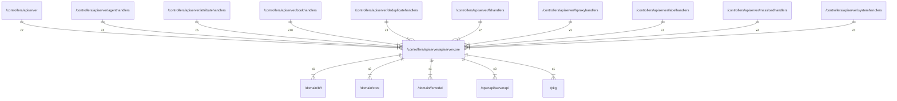

# apiservercore

## Imports

### Inner imports

| Name      | Path                                             | Count |
|:----------|:-------------------------------------------------|------:|
| serverapi | [/openapi/serverapi](../../openapi/serverapi.md) |     3 |
| core      | [/domain/core](../../domain/core.md)             |     2 |
| bff       | [/domain/bff](../../domain/bff.md)               |     1 |
| fsmodel   | [/domain/fsmodel](../../domain/fsmodel.md)       |     1 |
| pkg       | [/pkg](../../pkg.md)                             |     1 |

### External imports

| Name  | Path                           | Count |
|:------|:-------------------------------|------:|
| uuid  | github.com/google/uuid         |     3 |
| trace | go.opentelemetry.io/otel/trace |     1 |

### Std imports

| Name    | Path     | Count |
|:--------|:---------|------:|
| context | context  |     3 |
| url     | net/url  |     3 |
| slog    | log/slog |     2 |
| time    | time     |     2 |
| fmt     | fmt      |     1 |
| strconv | strconv  |     1 |

## Used by

| Name                | Path                                                                 |
|:--------------------|:---------------------------------------------------------------------|
| apiserver           | [/controllers/apiserver](../apiserver.md)                            |
| agenthandlers       | [/controllers/apiserver/agenthandlers](agenthandlers.md)             |
| attributehandlers   | [/controllers/apiserver/attributehandlers](attributehandlers.md)     |
| bookhandlers        | [/controllers/apiserver/bookhandlers](bookhandlers.md)               |
| deduplicatehandlers | [/controllers/apiserver/deduplicatehandlers](deduplicatehandlers.md) |
| fshandlers          | [/controllers/apiserver/fshandlers](fshandlers.md)                   |
| hproxyhandlers      | [/controllers/apiserver/hproxyhandlers](hproxyhandlers.md)           |
| labelhandlers       | [/controllers/apiserver/labelhandlers](labelhandlers.md)             |
| massloadhandlers    | [/controllers/apiserver/massloadhandlers](massloadhandlers.md)       |
| systemhandlers      | [/controllers/apiserver/systemhandlers](systemhandlers.md)           |

## Scheme

```mermaid
erDiagram
    "/controllers/apiserver" ||--|{ "/controllers/apiserver/apiservercore" : x2
    "/controllers/apiserver/agenthandlers" ||--|{ "/controllers/apiserver/apiservercore" : x5
    "/controllers/apiserver/apiservercore" ||--|{ "/domain/bff" : x1
    "/controllers/apiserver/apiservercore" ||--|{ "/domain/core" : x2
    "/controllers/apiserver/apiservercore" ||--|{ "/domain/fsmodel" : x1
    "/controllers/apiserver/apiservercore" ||--|{ "/openapi/serverapi" : x3
    "/controllers/apiserver/apiservercore" ||--|{ "/pkg" : x1
    "/controllers/apiserver/attributehandlers" ||--|{ "/controllers/apiserver/apiservercore" : x5
    "/controllers/apiserver/bookhandlers" ||--|{ "/controllers/apiserver/apiservercore" : x10
    "/controllers/apiserver/deduplicatehandlers" ||--|{ "/controllers/apiserver/apiservercore" : x3
    "/controllers/apiserver/fshandlers" ||--|{ "/controllers/apiserver/apiservercore" : x7
    "/controllers/apiserver/hproxyhandlers" ||--|{ "/controllers/apiserver/apiservercore" : x3
    "/controllers/apiserver/labelhandlers" ||--|{ "/controllers/apiserver/apiservercore" : x3
    "/controllers/apiserver/massloadhandlers" ||--|{ "/controllers/apiserver/apiservercore" : x4
    "/controllers/apiserver/systemhandlers" ||--|{ "/controllers/apiserver/apiservercore" : x5
```

---

> Generated by [goArchLint](https://github.com/gbh007/goarchlint)
