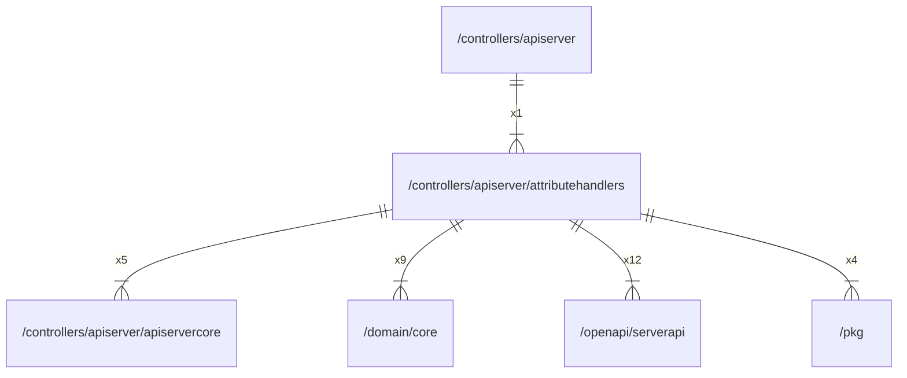

# attributehandlers

## Imports

### Inner imports

| Name          | Path                                                     | Count |
|:--------------|:---------------------------------------------------------|------:|
| serverapi     | [/openapi/serverapi](../../openapi/serverapi.md)         |    12 |
| core          | [/domain/core](../../domain/core.md)                     |     9 |
| apiservercore | [/controllers/apiserver/apiservercore](apiservercore.md) |     5 |
| pkg           | [/pkg](../../pkg.md)                                     |     4 |

### External imports

| Name  | Path                           | Count |
|:------|:-------------------------------|------:|
| trace | go.opentelemetry.io/otel/trace |     1 |

### Std imports

| Name    | Path     | Count |
|:--------|:---------|------:|
| context | context  |    13 |
| http    | net/http |     2 |
| slog    | log/slog |     1 |

## Used by

| Name      | Path                                      |
|:----------|:------------------------------------------|
| apiserver | [/controllers/apiserver](../apiserver.md) |

## Scheme

```mermaid
erDiagram
    "/controllers/apiserver" ||--|{ "/controllers/apiserver/attributehandlers" : x1
    "/controllers/apiserver/attributehandlers" ||--|{ "/controllers/apiserver/apiservercore" : x5
    "/controllers/apiserver/attributehandlers" ||--|{ "/domain/core" : x9
    "/controllers/apiserver/attributehandlers" ||--|{ "/openapi/serverapi" : x12
    "/controllers/apiserver/attributehandlers" ||--|{ "/pkg" : x4
```

---

> Generated by [goArchLint](https://github.com/gbh007/goarchlint)
