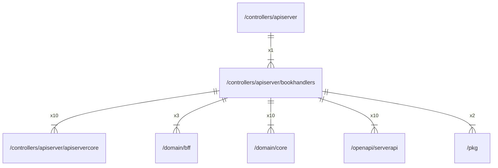

# bookhandlers

## Imports

### Inner imports

| Name          | Path                                                     | Count |
|:--------------|:---------------------------------------------------------|------:|
| apiservercore | [/controllers/apiserver/apiservercore](apiservercore.md) |    10 |
| core          | [/domain/core](../../domain/core.md)                     |    10 |
| serverapi     | [/openapi/serverapi](../../openapi/serverapi.md)         |    10 |
| bff           | [/domain/bff](../../domain/bff.md)                       |     3 |
| pkg           | [/pkg](../../pkg.md)                                     |     2 |

### External imports

| Name  | Path                           | Count |
|:------|:-------------------------------|------:|
| uuid  | github.com/google/uuid         |     1 |
| trace | go.opentelemetry.io/otel/trace |     1 |

### Std imports

| Name    | Path     | Count |
|:--------|:---------|------:|
| context | context  |    11 |
| errors  | errors   |     8 |
| http    | net/http |     8 |
| fmt     | fmt      |     3 |
| io      | io       |     1 |
| slog    | log/slog |     1 |
| url     | net/url  |     1 |

## Used by

| Name      | Path                                      |
|:----------|:------------------------------------------|
| apiserver | [/controllers/apiserver](../apiserver.md) |

## Scheme

```mermaid
erDiagram
    "/controllers/apiserver" ||--|{ "/controllers/apiserver/bookhandlers" : x1
    "/controllers/apiserver/bookhandlers" ||--|{ "/controllers/apiserver/apiservercore" : x10
    "/controllers/apiserver/bookhandlers" ||--|{ "/domain/bff" : x3
    "/controllers/apiserver/bookhandlers" ||--|{ "/domain/core" : x10
    "/controllers/apiserver/bookhandlers" ||--|{ "/openapi/serverapi" : x10
    "/controllers/apiserver/bookhandlers" ||--|{ "/pkg" : x2
```

---

> Generated by [goArchLint](https://github.com/gbh007/goarchlint)
