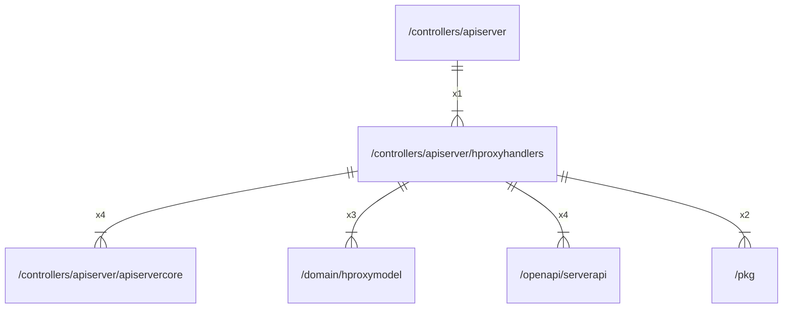

# hproxyhandlers

## Imports

|     Name      |                           Path                           | Inner | Count |
|:-------------:|:--------------------------------------------------------:|:-----:|:-----:|
|    context    |                         context                          |  ❌   |   4   |
| apiservercore | [/controllers/apiserver/apiservercore](apiservercore.md) |  ✅   |   4   |
|   serverapi   |     [/openapi/serverapi](../../openapi/serverapi.md)     |  ✅   |   4   |
|  hproxymodel  |    [/domain/hproxymodel](../../domain/hproxymodel.md)    |  ✅   |   3   |
|      pkg      |                   [/pkg](../../pkg.md)                   |  ✅   |   2   |
|     trace     |              go.opentelemetry.io/otel/trace              |  ❌   |   1   |
|      io       |                            io                            |  ❌   |   1   |
|     slog      |                         log/slog                         |  ❌   |   1   |
|     mime      |                           mime                           |  ❌   |   1   |
|      url      |                         net/url                          |  ❌   |   1   |
|     path      |                           path                           |  ❌   |   1   |

## Used by

|   Name    |                   Path                    |
|:---------:|:-----------------------------------------:|
| apiserver | [/controllers/apiserver](../apiserver.md) |

## Scheme

---

> Generated by [goArchLint](https://github.com/gbh007/goarchlint)
