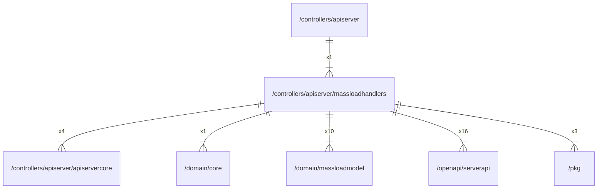

# massloadhandlers

## Imports

### Inner imports

| Name          | Path                                                     | Count |
|:--------------|:---------------------------------------------------------|------:|
| serverapi     | [/openapi/serverapi](../../openapi/serverapi.md)         |    16 |
| massloadmodel | [/domain/massloadmodel](../../domain/massloadmodel.md)   |    10 |
| apiservercore | [/controllers/apiserver/apiservercore](apiservercore.md) |     4 |
| pkg           | [/pkg](../../pkg.md)                                     |     3 |
| core          | [/domain/core](../../domain/core.md)                     |     1 |

### External imports

| Name  | Path                           | Count |
|:------|:-------------------------------|------:|
| trace | go.opentelemetry.io/otel/trace |     1 |

### Std imports

| Name    | Path     | Count |
|:--------|:---------|------:|
| context | context  |    17 |
| slog    | log/slog |     1 |
| http    | net/http |     1 |
| url     | net/url  |     1 |

## Used by

| Name      | Path                                      |
|:----------|:------------------------------------------|
| apiserver | [/controllers/apiserver](../apiserver.md) |

## Scheme

```mermaid
erDiagram
    "/controllers/apiserver" ||--|{ "/controllers/apiserver/massloadhandlers" : x1
    "/controllers/apiserver/massloadhandlers" ||--|{ "/controllers/apiserver/apiservercore" : x4
    "/controllers/apiserver/massloadhandlers" ||--|{ "/domain/core" : x1
    "/controllers/apiserver/massloadhandlers" ||--|{ "/domain/massloadmodel" : x10
    "/controllers/apiserver/massloadhandlers" ||--|{ "/openapi/serverapi" : x16
    "/controllers/apiserver/massloadhandlers" ||--|{ "/pkg" : x3
```

---

> Generated by [goArchLint](https://github.com/gbh007/goarchlint)
