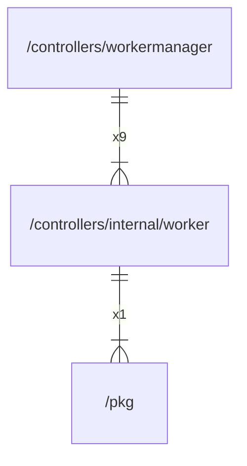

# worker

## Imports

|   Name    |                Path                | Inner | Count |
|:---------:|:----------------------------------:|:-----:|:-----:|
|  context  |              context               |  ❌   |   2   |
|   trace   |   go.opentelemetry.io/otel/trace   |  ❌   |   2   |
|   slog    |              log/slog              |  ❌   |   2   |
|   sync    |                sync                |  ❌   |   2   |
|   time    |                time                |  ❌   |   2   |
|    fmt    |                fmt                 |  ❌   |   1   |
|    pkg    |        [/pkg](../../pkg.md)        |  ✅   |   1   |
| attribute | go.opentelemetry.io/otel/attribute |  ❌   |   1   |
|  runtime  |              runtime               |  ❌   |   1   |
|  strconv  |              strconv               |  ❌   |   1   |
|  atomic   |            sync/atomic             |  ❌   |   1   |

## Used by

|     Name      |                       Path                        |
|:-------------:|:-------------------------------------------------:|
| workermanager | [/controllers/workermanager](../workermanager.md) |

## Scheme

---

> Generated by [goArchLint](https://github.com/gbh007/goarchlint)
