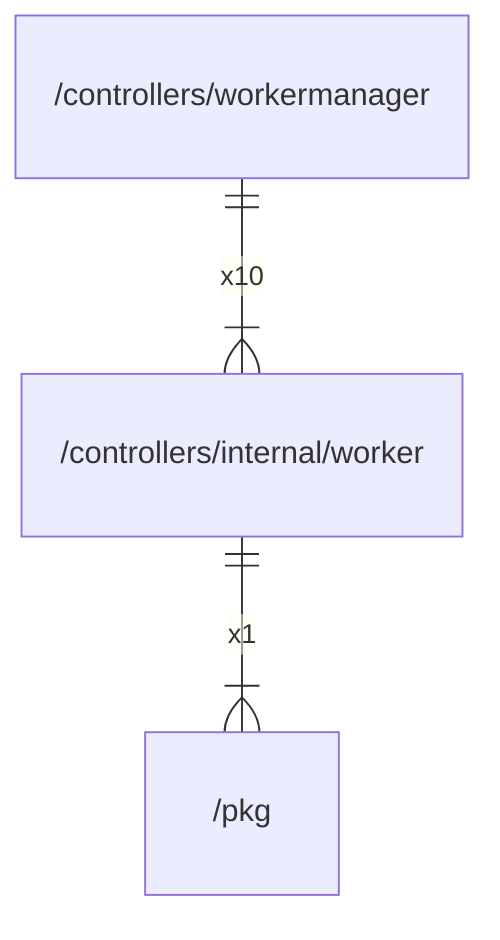

# worker

## Imports

### Inner imports

| Name | Path                 | Count |
|:-----|:---------------------|------:|
| pkg  | [/pkg](../../pkg.md) |     1 |

### External imports

| Name      | Path                               | Count |
|:----------|:-----------------------------------|------:|
| trace     | go.opentelemetry.io/otel/trace     |     2 |
| attribute | go.opentelemetry.io/otel/attribute |     1 |

### Std imports

| Name    | Path        | Count |
|:--------|:------------|------:|
| context | context     |     2 |
| slog    | log/slog    |     2 |
| sync    | sync        |     2 |
| time    | time        |     2 |
| fmt     | fmt         |     1 |
| runtime | runtime     |     1 |
| strconv | strconv     |     1 |
| atomic  | sync/atomic |     1 |

## Used by

| Name          | Path                                              |
|:--------------|:--------------------------------------------------|
| workermanager | [/controllers/workermanager](../workermanager.md) |

## Scheme

```mermaid
erDiagram
    "/controllers/internal/worker" ||--|{ "/pkg" : x1
    "/controllers/workermanager" ||--|{ "/controllers/internal/worker" : x10
```

---

> Generated by [goArchLint](https://github.com/gbh007/goarchlint)
