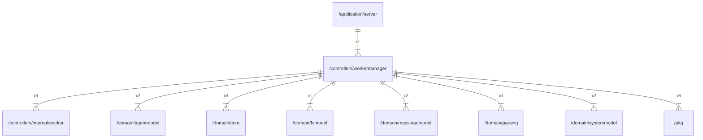

# workermanager

## Imports

|     Name      |                        Path                         | Inner | Count |
|:-------------:|:---------------------------------------------------:|:-----:|:-----:|
|    context    |                       context                       |  ❌   |  10   |
|     slog      |                      log/slog                       |  ❌   |  10   |
|    worker     | [/controllers/internal/worker](internal/worker.md)  |  ✅   |   9   |
|     trace     |           go.opentelemetry.io/otel/trace            |  ❌   |   9   |
|      pkg      |                  [/pkg](../pkg.md)                  |  ✅   |   8   |
|     core      |          [/domain/core](../domain/core.md)          |  ✅   |   3   |
|     uuid      |               github.com/google/uuid                |  ❌   |   3   |
|  agentmodel   |    [/domain/agentmodel](../domain/agentmodel.md)    |  ✅   |   2   |
| massloadmodel | [/domain/massloadmodel](../domain/massloadmodel.md) |  ✅   |   2   |
|  systemmodel  |   [/domain/systemmodel](../domain/systemmodel.md)   |  ✅   |   2   |
|    fsmodel    |       [/domain/fsmodel](../domain/fsmodel.md)       |  ✅   |   1   |
|    parsing    |       [/domain/parsing](../domain/parsing.md)       |  ✅   |   1   |
|     sync      |                        sync                         |  ❌   |   1   |
|     time      |                        time                         |  ❌   |   1   |

## Used by

|  Name  |                      Path                       |
|:------:|:-----------------------------------------------:|
| server | [/application/server](../application/server.md) |

## Scheme

---

> Generated by [goArchLint](https://github.com/gbh007/goarchlint)
