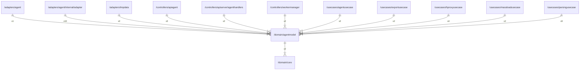

# agentmodel

## Imports

|  Name  |          Path           | Inner | Count |
|:------:|:-----------------------:|:-----:|:-----:|
|  core  | [/domain/core](core.md) |  ✅   |   2   |
|  uuid  | github.com/google/uuid  |  ❌   |   2   |
| errors |         errors          |  ❌   |   1   |
|   io   |           io            |  ❌   |   1   |
|  url   |         net/url         |  ❌   |   1   |
|  time  |          time           |  ❌   |   1   |

## Used by

|      Name       |                                       Path                                        |
|:---------------:|:---------------------------------------------------------------------------------:|
|      agent      |                      [/adapters/agent](../adapters/agent.md)                      |
|     adapter     |     [/adapters/agent/internal/adapter](../adapters/agent/internal/adapter.md)     |
|     tmpdata     |                    [/adapters/tmpdata](../adapters/tmpdata.md)                    |
|    apiagent     |                [/controllers/apiagent](../controllers/apiagent.md)                |
|  agenthandlers  | [/controllers/apiserver/agenthandlers](../controllers/apiserver/agenthandlers.md) |
|  workermanager  |           [/controllers/workermanager](../controllers/workermanager.md)           |
|  agentusecase   |               [/usecases/agentusecase](../usecases/agentusecase.md)               |
|  exportusecase  |              [/usecases/exportusecase](../usecases/exportusecase.md)              |
|  hproxyusecase  |              [/usecases/hproxyusecase](../usecases/hproxyusecase.md)              |
| massloadusecase |            [/usecases/massloadusecase](../usecases/massloadusecase.md)            |
| parsingusecase  |             [/usecases/parsingusecase](../usecases/parsingusecase.md)             |

## Scheme

---

> Generated by [goArchLint](https://github.com/gbh007/goarchlint)
