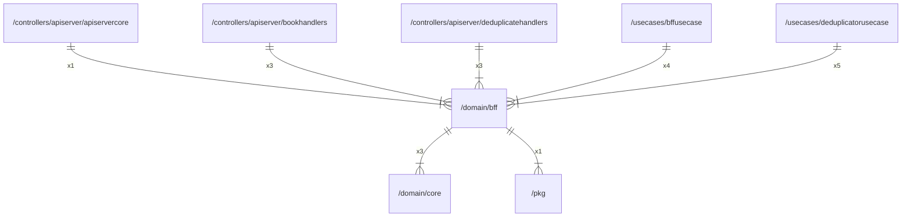

# bff

## Imports

| Name |          Path           | Inner | Count |
|:----:|:-----------------------:|:-----:|:-----:|
| core | [/domain/core](core.md) |  ✅   |   3   |
| uuid | github.com/google/uuid  |  ❌   |   2   |
| pkg  |    [/pkg](../pkg.md)    |  ✅   |   1   |
| math |          math           |  ❌   |   1   |

## Used by

|        Name         |                                             Path                                              |
|:-------------------:|:---------------------------------------------------------------------------------------------:|
|    apiservercore    |       [/controllers/apiserver/apiservercore](../controllers/apiserver/apiservercore.md)       |
|    bookhandlers     |        [/controllers/apiserver/bookhandlers](../controllers/apiserver/bookhandlers.md)        |
| deduplicatehandlers | [/controllers/apiserver/deduplicatehandlers](../controllers/apiserver/deduplicatehandlers.md) |
|     bffusecase      |                       [/usecases/bffusecase](../usecases/bffusecase.md)                       |
| deduplicatorusecase |              [/usecases/deduplicatorusecase](../usecases/deduplicatorusecase.md)              |

## Scheme

---

> Generated by [goArchLint](https://github.com/gbh007/goarchlint)
