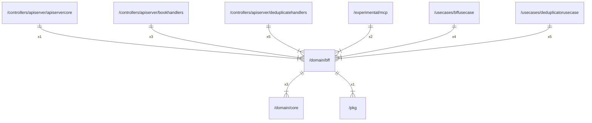

# bff

## Imports

### Inner imports

| Name | Path                    | Count |
|:-----|:------------------------|------:|
| core | [/domain/core](core.md) |     3 |
| pkg  | [/pkg](../pkg.md)       |     1 |

### External imports

| Name | Path                   | Count |
|:-----|:-----------------------|------:|
| uuid | github.com/google/uuid |     2 |

### Std imports

| Name | Path | Count |
|:-----|:-----|------:|
| math | math |     1 |

## Used by

| Name                | Path                                                                                          |
|:--------------------|:----------------------------------------------------------------------------------------------|
| apiservercore       | [/controllers/apiserver/apiservercore](../controllers/apiserver/apiservercore.md)             |
| bookhandlers        | [/controllers/apiserver/bookhandlers](../controllers/apiserver/bookhandlers.md)               |
| deduplicatehandlers | [/controllers/apiserver/deduplicatehandlers](../controllers/apiserver/deduplicatehandlers.md) |
| mcp                 | [/experimental/mcp](../experimental/mcp.md)                                                   |
| bffusecase          | [/usecases/bffusecase](../usecases/bffusecase.md)                                             |
| deduplicatorusecase | [/usecases/deduplicatorusecase](../usecases/deduplicatorusecase.md)                           |

## Scheme

```mermaid
erDiagram
    "/controllers/apiserver/apiservercore" ||--|{ "/domain/bff" : x1
    "/controllers/apiserver/bookhandlers" ||--|{ "/domain/bff" : x3
    "/controllers/apiserver/deduplicatehandlers" ||--|{ "/domain/bff" : x5
    "/domain/bff" ||--|{ "/domain/core" : x3
    "/domain/bff" ||--|{ "/pkg" : x1
    "/experimental/mcp" ||--|{ "/domain/bff" : x2
    "/usecases/bffusecase" ||--|{ "/domain/bff" : x4
    "/usecases/deduplicatorusecase" ||--|{ "/domain/bff" : x5
```

---

> Generated by [goArchLint](https://github.com/gbh007/goarchlint)
