# core

## Imports

|  Name   |          Path          | Inner | Count |
|:-------:|:----------------------:|:-----:|:-----:|
|  uuid   | github.com/google/uuid |  ❌   |   8   |
|  time   |          time          |  ❌   |   8   |
|   url   |        net/url         |  ❌   |   4   |
| strings |        strings         |  ❌   |   3   |
| errors  |         errors         |  ❌   |   2   |
| strconv |        strconv         |  ❌   |   2   |
|   md5   |       crypto/md5       |  ❌   |   1   |
| sha256  |     crypto/sha256      |  ❌   |   1   |
|   fmt   |          fmt           |  ❌   |   1   |
|   pkg   |   [/pkg](../pkg.md)    |  ✅   |   1   |
|   io    |           io           |  ❌   |   1   |

## Used by

|        Name         |                                             Path                                              |
|:-------------------:|:---------------------------------------------------------------------------------------------:|
|        agent        |                            [/adapters/agent](../adapters/agent.md)                            |
|       adapter       |           [/adapters/agent/internal/adapter](../adapters/agent/internal/adapter.md)           |
|     filestorage     |                      [/adapters/filestorage](../adapters/filestorage.md)                      |
|     localfiles      |                       [/adapters/localfiles](../adapters/localfiles.md)                       |
|       metric        |                           [/adapters/metric](../adapters/metric.md)                           |
|        agent        |        [/adapters/postgresql/internal/agent](../adapters/postgresql/internal/agent.md)        |
|      attribute      |    [/adapters/postgresql/internal/attribute](../adapters/postgresql/internal/attribute.md)    |
|        book         |         [/adapters/postgresql/internal/book](../adapters/postgresql/internal/book.md)         |
|      deadhash       |     [/adapters/postgresql/internal/deadhash](../adapters/postgresql/internal/deadhash.md)     |
|        file         |         [/adapters/postgresql/internal/file](../adapters/postgresql/internal/file.md)         |
|        label        |        [/adapters/postgresql/internal/label](../adapters/postgresql/internal/label.md)        |
|        model        |        [/adapters/postgresql/internal/model](../adapters/postgresql/internal/model.md)        |
|        page         |         [/adapters/postgresql/internal/page](../adapters/postgresql/internal/page.md)         |
|       server        |                        [/application/server](../application/server.md)                        |
|      apiagent       |                      [/controllers/apiagent](../controllers/apiagent.md)                      |
|    agenthandlers    |       [/controllers/apiserver/agenthandlers](../controllers/apiserver/agenthandlers.md)       |
|    apiservercore    |       [/controllers/apiserver/apiservercore](../controllers/apiserver/apiservercore.md)       |
|  attributehandlers  |   [/controllers/apiserver/attributehandlers](../controllers/apiserver/attributehandlers.md)   |
|    bookhandlers     |        [/controllers/apiserver/bookhandlers](../controllers/apiserver/bookhandlers.md)        |
| deduplicatehandlers | [/controllers/apiserver/deduplicatehandlers](../controllers/apiserver/deduplicatehandlers.md) |
|     fshandlers      |          [/controllers/apiserver/fshandlers](../controllers/apiserver/fshandlers.md)          |
|    labelhandlers    |       [/controllers/apiserver/labelhandlers](../controllers/apiserver/labelhandlers.md)       |
|  massloadhandlers   |    [/controllers/apiserver/massloadhandlers](../controllers/apiserver/massloadhandlers.md)    |
|   systemhandlers    |      [/controllers/apiserver/systemhandlers](../controllers/apiserver/systemhandlers.md)      |
|    workermanager    |                 [/controllers/workermanager](../controllers/workermanager.md)                 |
|     agentmodel      |                              [/domain/agentmodel](agentmodel.md)                              |
|         bff         |                                     [/domain/bff](bff.md)                                     |
|       fsmodel       |                                 [/domain/fsmodel](fsmodel.md)                                 |
|       parsing       |                                 [/domain/parsing](parsing.md)                                 |
|      external       |                                  [/external](../external.md)                                  |
|    agentusecase     |                     [/usecases/agentusecase](../usecases/agentusecase.md)                     |
|  attributeusecase   |                 [/usecases/attributeusecase](../usecases/attributeusecase.md)                 |
|     bffusecase      |                       [/usecases/bffusecase](../usecases/bffusecase.md)                       |
|     bookusecase     |                      [/usecases/bookusecase](../usecases/bookusecase.md)                      |
|   cleanupusecase    |                   [/usecases/cleanupusecase](../usecases/cleanupusecase.md)                   |
| deduplicatorusecase |              [/usecases/deduplicatorusecase](../usecases/deduplicatorusecase.md)              |
|    exportusecase    |                    [/usecases/exportusecase](../usecases/exportusecase.md)                    |
|  filesystemusecase  |                [/usecases/filesystemusecase](../usecases/filesystemusecase.md)                |
|    hproxyusecase    |                    [/usecases/hproxyusecase](../usecases/hproxyusecase.md)                    |
|    labelusecase     |                     [/usecases/labelusecase](../usecases/labelusecase.md)                     |
|   massloadusecase   |                  [/usecases/massloadusecase](../usecases/massloadusecase.md)                  |
|   parsingusecase    |                   [/usecases/parsingusecase](../usecases/parsingusecase.md)                   |
|  rebuilderusecase   |                 [/usecases/rebuilderusecase](../usecases/rebuilderusecase.md)                 |

## Scheme

```mermaid
erDiagram
    "/adapters/agent" ||--|{ "/domain/core" : x1
    "/adapters/agent/internal/adapter" ||--|{ "/domain/core" : x1
    "/adapters/filestorage" ||--|{ "/domain/core" : x3
    "/adapters/localfiles" ||--|{ "/domain/core" : x2
    "/adapters/metric" ||--|{ "/domain/core" : x1
    "/adapters/postgresql/internal/agent" ||--|{ "/domain/core" : x5
    "/adapters/postgresql/internal/attribute" ||--|{ "/domain/core" : x15
    "/adapters/postgresql/internal/book" ||--|{ "/domain/core" : x14
    "/adapters/postgresql/internal/deadhash" ||--|{ "/domain/core" : x5
    "/adapters/postgresql/internal/file" ||--|{ "/domain/core" : x11
    "/adapters/postgresql/internal/label" ||--|{ "/domain/core" : x9
    "/adapters/postgresql/internal/model" ||--|{ "/domain/core" : x8
    "/adapters/postgresql/internal/page" ||--|{ "/domain/core" : x17
    "/application/server" ||--|{ "/domain/core" : x1
    "/controllers/apiagent" ||--|{ "/domain/core" : x2
    "/controllers/apiserver/agenthandlers" ||--|{ "/domain/core" : x6
    "/controllers/apiserver/apiservercore" ||--|{ "/domain/core" : x2
    "/controllers/apiserver/attributehandlers" ||--|{ "/domain/core" : x9
    "/controllers/apiserver/bookhandlers" ||--|{ "/domain/core" : x10
    "/controllers/apiserver/deduplicatehandlers" ||--|{ "/domain/core" : x4
    "/controllers/apiserver/fshandlers" ||--|{ "/domain/core" : x4
    "/controllers/apiserver/labelhandlers" ||--|{ "/domain/core" : x7
    "/controllers/apiserver/massloadhandlers" ||--|{ "/domain/core" : x1
    "/controllers/apiserver/systemhandlers" ||--|{ "/domain/core" : x1
    "/controllers/workermanager" ||--|{ "/domain/core" : x3
    "/domain/agentmodel" ||--|{ "/domain/core" : x2
    "/domain/bff" ||--|{ "/domain/core" : x3
    "/domain/core" ||--|{ "/pkg" : x1
    "/domain/fsmodel" ||--|{ "/domain/core" : x1
    "/domain/parsing" ||--|{ "/domain/core" : x1
    "/external" ||--|{ "/domain/core" : x3
    "/usecases/agentusecase" ||--|{ "/domain/core" : x6
    "/usecases/attributeusecase" ||--|{ "/domain/core" : x5
    "/usecases/bffusecase" ||--|{ "/domain/core" : x3
    "/usecases/bookusecase" ||--|{ "/domain/core" : x2
    "/usecases/cleanupusecase" ||--|{ "/domain/core" : x5
    "/usecases/deduplicatorusecase" ||--|{ "/domain/core" : x12
    "/usecases/exportusecase" ||--|{ "/domain/core" : x3
    "/usecases/filesystemusecase" ||--|{ "/domain/core" : x5
    "/usecases/hproxyusecase" ||--|{ "/domain/core" : x5
    "/usecases/labelusecase" ||--|{ "/domain/core" : x2
    "/usecases/massloadusecase" ||--|{ "/domain/core" : x3
    "/usecases/parsingusecase" ||--|{ "/domain/core" : x9
    "/usecases/rebuilderusecase" ||--|{ "/domain/core" : x10
```

---

> Generated by [goArchLint](https://github.com/gbh007/goarchlint)
