# fsmodel

## Imports

| Name |          Path           | Inner | Count |
|:----:|:-----------------------:|:-----:|:-----:|
| core | [/domain/core](core.md) |  ✅   |   1   |
| uuid | github.com/google/uuid  |  ❌   |   1   |
| url  |         net/url         |  ❌   |   1   |
| time |          time           |  ❌   |   1   |

## Used by

|       Name        |                                       Path                                        |
|:-----------------:|:---------------------------------------------------------------------------------:|
|       agent       |                      [/adapters/agent](../adapters/agent.md)                      |
|      adapter      |     [/adapters/agent/internal/adapter](../adapters/agent/internal/adapter.md)     |
|      agentfs      |                    [/adapters/agentfs](../adapters/agentfs.md)                    |
|    filestorage    |                [/adapters/filestorage](../adapters/filestorage.md)                |
|    localfiles     |                 [/adapters/localfiles](../adapters/localfiles.md)                 |
|       file        |   [/adapters/postgresql/internal/file](../adapters/postgresql/internal/file.md)   |
|       model       |  [/adapters/postgresql/internal/model](../adapters/postgresql/internal/model.md)  |
|       other       |  [/adapters/postgresql/internal/other](../adapters/postgresql/internal/other.md)  |
|      tmpdata      |                    [/adapters/tmpdata](../adapters/tmpdata.md)                    |
|   apiservercore   | [/controllers/apiserver/apiservercore](../controllers/apiserver/apiservercore.md) |
|    fshandlers     |    [/controllers/apiserver/fshandlers](../controllers/apiserver/fshandlers.md)    |
|   workermanager   |           [/controllers/workermanager](../controllers/workermanager.md)           |
|    bffusecase     |                 [/usecases/bffusecase](../usecases/bffusecase.md)                 |
|  cleanupusecase   |             [/usecases/cleanupusecase](../usecases/cleanupusecase.md)             |
| filesystemusecase |          [/usecases/filesystemusecase](../usecases/filesystemusecase.md)          |

## Scheme

```mermaid
erDiagram
    "/adapters/agent" ||--|{ "/domain/fsmodel" : x1
    "/adapters/agent/internal/adapter" ||--|{ "/domain/fsmodel" : x1
    "/adapters/agentfs" ||--|{ "/domain/fsmodel" : x1
    "/adapters/filestorage" ||--|{ "/domain/fsmodel" : x4
    "/adapters/localfiles" ||--|{ "/domain/fsmodel" : x1
    "/adapters/postgresql/internal/file" ||--|{ "/domain/fsmodel" : x5
    "/adapters/postgresql/internal/model" ||--|{ "/domain/fsmodel" : x1
    "/adapters/postgresql/internal/other" ||--|{ "/domain/fsmodel" : x1
    "/adapters/tmpdata" ||--|{ "/domain/fsmodel" : x2
    "/controllers/apiserver/apiservercore" ||--|{ "/domain/fsmodel" : x1
    "/controllers/apiserver/fshandlers" ||--|{ "/domain/fsmodel" : x4
    "/controllers/workermanager" ||--|{ "/domain/fsmodel" : x1
    "/domain/fsmodel" ||--|{ "/domain/core" : x1
    "/usecases/bffusecase" ||--|{ "/domain/fsmodel" : x1
    "/usecases/cleanupusecase" ||--|{ "/domain/fsmodel" : x3
    "/usecases/filesystemusecase" ||--|{ "/domain/fsmodel" : x4
```

---

> Generated by [goArchLint](https://github.com/gbh007/goarchlint)
