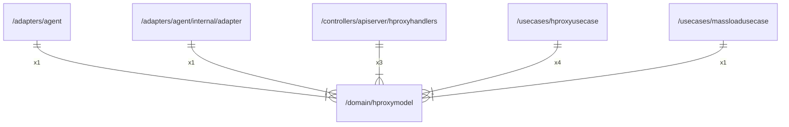

# hproxymodel

## Imports

| Name |          Path          | Inner | Count |
|:----:|:----------------------:|:-----:|:-----:|
| uuid | github.com/google/uuid |  ❌   |   1   |
| url  |        net/url         |  ❌   |   1   |

## Used by

|      Name       |                                        Path                                         |
|:---------------:|:-----------------------------------------------------------------------------------:|
|      agent      |                       [/adapters/agent](../adapters/agent.md)                       |
|     adapter     |      [/adapters/agent/internal/adapter](../adapters/agent/internal/adapter.md)      |
| hproxyhandlers  | [/controllers/apiserver/hproxyhandlers](../controllers/apiserver/hproxyhandlers.md) |
|  hproxyusecase  |               [/usecases/hproxyusecase](../usecases/hproxyusecase.md)               |
| massloadusecase |             [/usecases/massloadusecase](../usecases/massloadusecase.md)             |

## Scheme

---

> Generated by [goArchLint](https://github.com/gbh007/goarchlint)
