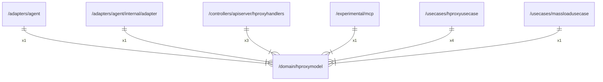

# hproxymodel

## Imports

### External imports

| Name | Path                   | Count |
|:-----|:-----------------------|------:|
| uuid | github.com/google/uuid |     1 |

### Std imports

| Name | Path    | Count |
|:-----|:--------|------:|
| url  | net/url |     1 |

## Used by

| Name            | Path                                                                                |
|:----------------|:------------------------------------------------------------------------------------|
| agent           | [/adapters/agent](../adapters/agent.md)                                             |
| adapter         | [/adapters/agent/internal/adapter](../adapters/agent/internal/adapter.md)           |
| hproxyhandlers  | [/controllers/apiserver/hproxyhandlers](../controllers/apiserver/hproxyhandlers.md) |
| mcp             | [/experimental/mcp](../experimental/mcp.md)                                         |
| hproxyusecase   | [/usecases/hproxyusecase](../usecases/hproxyusecase.md)                             |
| massloadusecase | [/usecases/massloadusecase](../usecases/massloadusecase.md)                         |

## Scheme

```mermaid
erDiagram
    "/adapters/agent" ||--|{ "/domain/hproxymodel" : x1
    "/adapters/agent/internal/adapter" ||--|{ "/domain/hproxymodel" : x1
    "/controllers/apiserver/hproxyhandlers" ||--|{ "/domain/hproxymodel" : x3
    "/experimental/mcp" ||--|{ "/domain/hproxymodel" : x1
    "/usecases/hproxyusecase" ||--|{ "/domain/hproxymodel" : x4
    "/usecases/massloadusecase" ||--|{ "/domain/hproxymodel" : x1
```

---

> Generated by [goArchLint](https://github.com/gbh007/goarchlint)
