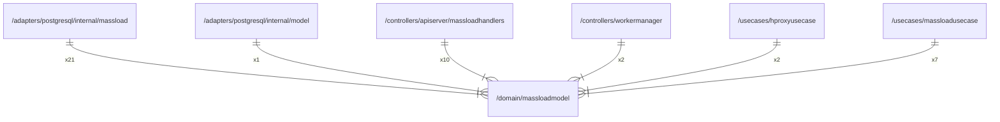

# massloadmodel

## Imports

| Name |  Path   | Inner | Count |
|:----:|:-------:|:-----:|:-----:|
| url  | net/url |  ❌   |   1   |
| time |  time   |  ❌   |   1   |

## Used by

|       Name       |                                          Path                                           |
|:----------------:|:---------------------------------------------------------------------------------------:|
|     massload     |  [/adapters/postgresql/internal/massload](../adapters/postgresql/internal/massload.md)  |
|      model       |     [/adapters/postgresql/internal/model](../adapters/postgresql/internal/model.md)     |
| massloadhandlers | [/controllers/apiserver/massloadhandlers](../controllers/apiserver/massloadhandlers.md) |
|  workermanager   |              [/controllers/workermanager](../controllers/workermanager.md)              |
|  hproxyusecase   |                 [/usecases/hproxyusecase](../usecases/hproxyusecase.md)                 |
| massloadusecase  |               [/usecases/massloadusecase](../usecases/massloadusecase.md)               |

## Scheme

---

> Generated by [goArchLint](https://github.com/gbh007/goarchlint)
