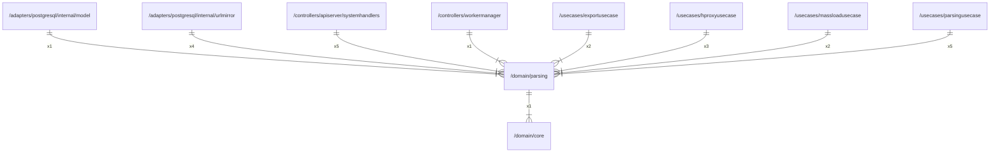

# parsing

## Imports

|  Name   |          Path           | Inner | Count |
|:-------:|:-----------------------:|:-----:|:-----:|
|  uuid   | github.com/google/uuid  |  ❌   |   3   |
|   url   |         net/url         |  ❌   |   2   |
|  core   | [/domain/core](core.md) |  ✅   |   1   |
| strings |         strings         |  ❌   |   1   |

## Used by

|      Name       |                                          Path                                           |
|:---------------:|:---------------------------------------------------------------------------------------:|
|      model      |     [/adapters/postgresql/internal/model](../adapters/postgresql/internal/model.md)     |
|    urlmirror    | [/adapters/postgresql/internal/urlmirror](../adapters/postgresql/internal/urlmirror.md) |
| systemhandlers  |   [/controllers/apiserver/systemhandlers](../controllers/apiserver/systemhandlers.md)   |
|  workermanager  |              [/controllers/workermanager](../controllers/workermanager.md)              |
|  exportusecase  |                 [/usecases/exportusecase](../usecases/exportusecase.md)                 |
|  hproxyusecase  |                 [/usecases/hproxyusecase](../usecases/hproxyusecase.md)                 |
| massloadusecase |               [/usecases/massloadusecase](../usecases/massloadusecase.md)               |
| parsingusecase  |                [/usecases/parsingusecase](../usecases/parsingusecase.md)                |

## Scheme

---

> Generated by [goArchLint](https://github.com/gbh007/goarchlint)
