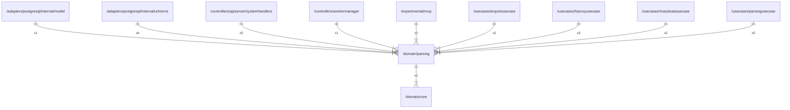

# parsing

## Imports

### Inner imports

| Name | Path                    | Count |
|:-----|:------------------------|------:|
| core | [/domain/core](core.md) |     1 |

### External imports

| Name | Path                   | Count |
|:-----|:-----------------------|------:|
| uuid | github.com/google/uuid |     4 |

### Std imports

| Name    | Path    | Count |
|:--------|:--------|------:|
| url     | net/url |     3 |
| fmt     | fmt     |     1 |
| strings | strings |     1 |

## Used by

| Name            | Path                                                                                    |
|:----------------|:----------------------------------------------------------------------------------------|
| model           | [/adapters/postgresql/internal/model](../adapters/postgresql/internal/model.md)         |
| urlmirror       | [/adapters/postgresql/internal/urlmirror](../adapters/postgresql/internal/urlmirror.md) |
| systemhandlers  | [/controllers/apiserver/systemhandlers](../controllers/apiserver/systemhandlers.md)     |
| workermanager   | [/controllers/workermanager](../controllers/workermanager.md)                           |
| mcp             | [/experimental/mcp](../experimental/mcp.md)                                             |
| exportusecase   | [/usecases/exportusecase](../usecases/exportusecase.md)                                 |
| hproxyusecase   | [/usecases/hproxyusecase](../usecases/hproxyusecase.md)                                 |
| massloadusecase | [/usecases/massloadusecase](../usecases/massloadusecase.md)                             |
| parsingusecase  | [/usecases/parsingusecase](../usecases/parsingusecase.md)                               |

## Scheme

```mermaid
erDiagram
    "/adapters/postgresql/internal/model" ||--|{ "/domain/parsing" : x1
    "/adapters/postgresql/internal/urlmirror" ||--|{ "/domain/parsing" : x4
    "/controllers/apiserver/systemhandlers" ||--|{ "/domain/parsing" : x5
    "/controllers/workermanager" ||--|{ "/domain/parsing" : x1
    "/domain/parsing" ||--|{ "/domain/core" : x1
    "/experimental/mcp" ||--|{ "/domain/parsing" : x2
    "/usecases/exportusecase" ||--|{ "/domain/parsing" : x2
    "/usecases/hproxyusecase" ||--|{ "/domain/parsing" : x3
    "/usecases/massloadusecase" ||--|{ "/domain/parsing" : x2
    "/usecases/parsingusecase" ||--|{ "/domain/parsing" : x5
```

---

> Generated by [goArchLint](https://github.com/gbh007/goarchlint)
