# systemmodel

## Imports

|  Name   |          Path          | Inner | Count |
|:-------:|:----------------------:|:-----:|:-----:|
| context |        context         |  ❌   |   1   |
|  uuid   | github.com/google/uuid |  ❌   |   1   |
|  time   |          time          |  ❌   |   1   |

## Used by

|        Name         |                                        Path                                         |
|:-------------------:|:-----------------------------------------------------------------------------------:|
|       metric        |                      [/adapters/metric](../adapters/metric.md)                      |
|    metricserver     |         [/adapters/metric/metricserver](../adapters/metric/metricserver.md)         |
|        other        |   [/adapters/postgresql/internal/other](../adapters/postgresql/internal/other.md)   |
|       tmpdata       |                     [/adapters/tmpdata](../adapters/tmpdata.md)                     |
|       server        |                   [/application/server](../application/server.md)                   |
|   systemhandlers    | [/controllers/apiserver/systemhandlers](../controllers/apiserver/systemhandlers.md) |
|    workermanager    |            [/controllers/workermanager](../controllers/workermanager.md)            |
|  attributeusecase   |            [/usecases/attributeusecase](../usecases/attributeusecase.md)            |
|   cleanupusecase    |              [/usecases/cleanupusecase](../usecases/cleanupusecase.md)              |
| deduplicatorusecase |         [/usecases/deduplicatorusecase](../usecases/deduplicatorusecase.md)         |
|    labelusecase     |                [/usecases/labelusecase](../usecases/labelusecase.md)                |
|   massloadusecase   |             [/usecases/massloadusecase](../usecases/massloadusecase.md)             |
|    systemusecase    |               [/usecases/systemusecase](../usecases/systemusecase.md)               |

## Scheme

```mermaid
erDiagram
    "/adapters/metric" ||--|{ "/domain/systemmodel" : x1
    "/adapters/metric/metricserver" ||--|{ "/domain/systemmodel" : x1
    "/adapters/postgresql/internal/other" ||--|{ "/domain/systemmodel" : x1
    "/adapters/tmpdata" ||--|{ "/domain/systemmodel" : x2
    "/application/server" ||--|{ "/domain/systemmodel" : x1
    "/controllers/apiserver/systemhandlers" ||--|{ "/domain/systemmodel" : x4
    "/controllers/workermanager" ||--|{ "/domain/systemmodel" : x2
    "/usecases/attributeusecase" ||--|{ "/domain/systemmodel" : x1
    "/usecases/cleanupusecase" ||--|{ "/domain/systemmodel" : x7
    "/usecases/deduplicatorusecase" ||--|{ "/domain/systemmodel" : x1
    "/usecases/labelusecase" ||--|{ "/domain/systemmodel" : x1
    "/usecases/massloadusecase" ||--|{ "/domain/systemmodel" : x2
    "/usecases/systemusecase" ||--|{ "/domain/systemmodel" : x3
```

---

> Generated by [goArchLint](https://github.com/gbh007/goarchlint)
