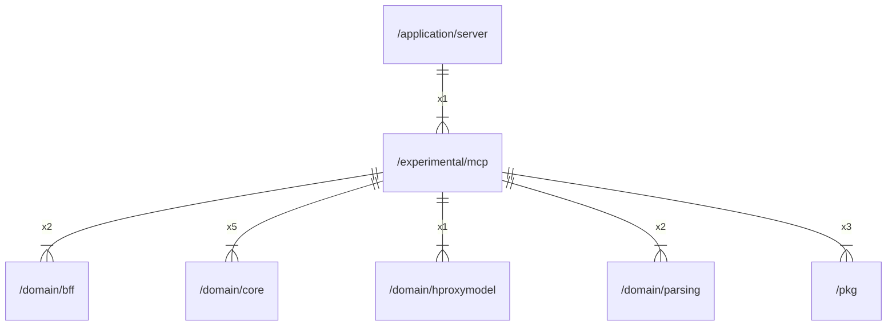

# mcp

## Imports

### Inner imports

| Name        | Path                                            | Count |
|:------------|:------------------------------------------------|------:|
| core        | [/domain/core](../domain/core.md)               |     5 |
| pkg         | [/pkg](../pkg.md)                               |     3 |
| bff         | [/domain/bff](../domain/bff.md)                 |     2 |
| parsing     | [/domain/parsing](../domain/parsing.md)         |     2 |
| hproxymodel | [/domain/hproxymodel](../domain/hproxymodel.md) |     1 |

### External imports

| Name   | Path                               | Count |
|:-------|:-----------------------------------|------:|
| server | github.com/mark3labs/mcp-go/server |     7 |
| mcp    | github.com/mark3labs/mcp-go/mcp    |     6 |
| uuid   | github.com/google/uuid             |     3 |
| trace  | go.opentelemetry.io/otel/trace     |     1 |

### Std imports

| Name    | Path     | Count |
|:--------|:---------|------:|
| context | context  |     7 |
| fmt     | fmt      |     6 |
| http    | net/http |     4 |
| url     | net/url  |     4 |
| bytes   | bytes    |     2 |
| slog    | log/slog |     2 |
| strings | strings  |     2 |
| errors  | errors   |     1 |
| io      | io       |     1 |
| time    | time     |     1 |

## Used by

| Name   | Path                                            |
|:-------|:------------------------------------------------|
| server | [/application/server](../application/server.md) |

## Scheme

---

> Generated by [goArchLint](https://github.com/gbh007/goarchlint)
