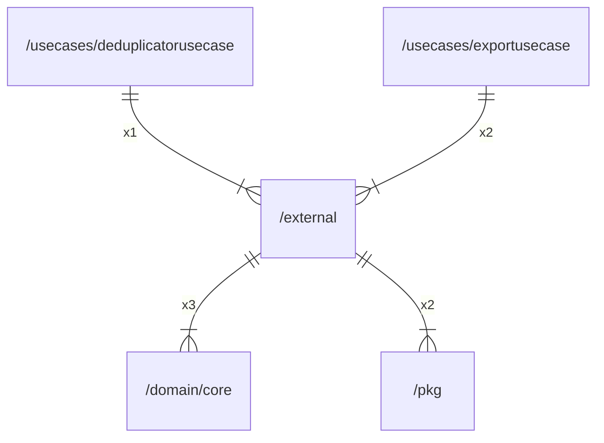

# external

## Imports

|  Name   |              Path              | Inner | Count |
|:-------:|:------------------------------:|:-----:|:-----:|
|   io    |               io               |  ❌   |   4   |
|   zip   |          archive/zip           |  ❌   |   3   |
| context |            context             |  ❌   |   3   |
|  json   |         encoding/json          |  ❌   |   3   |
|   fmt   |              fmt               |  ❌   |   3   |
|  core   | [/domain/core](domain/core.md) |  ✅   |   3   |
| strings |            strings             |  ❌   |   3   |
|  time   |              time              |  ❌   |   3   |
| errors  |             errors             |  ❌   |   2   |
|   pkg   |         [/pkg](pkg.md)         |  ✅   |   2   |
| strconv |            strconv             |  ❌   |   2   |
|  uuid   |     github.com/google/uuid     |  ❌   |   1   |
|   url   |            net/url             |  ❌   |   1   |

## Used by

|        Name         |                               Path                               |
|:-------------------:|:----------------------------------------------------------------:|
| deduplicatorusecase | [/usecases/deduplicatorusecase](usecases/deduplicatorusecase.md) |
|    exportusecase    |       [/usecases/exportusecase](usecases/exportusecase.md)       |

## Scheme

---

> Generated by [goArchLint](https://github.com/gbh007/goarchlint)
