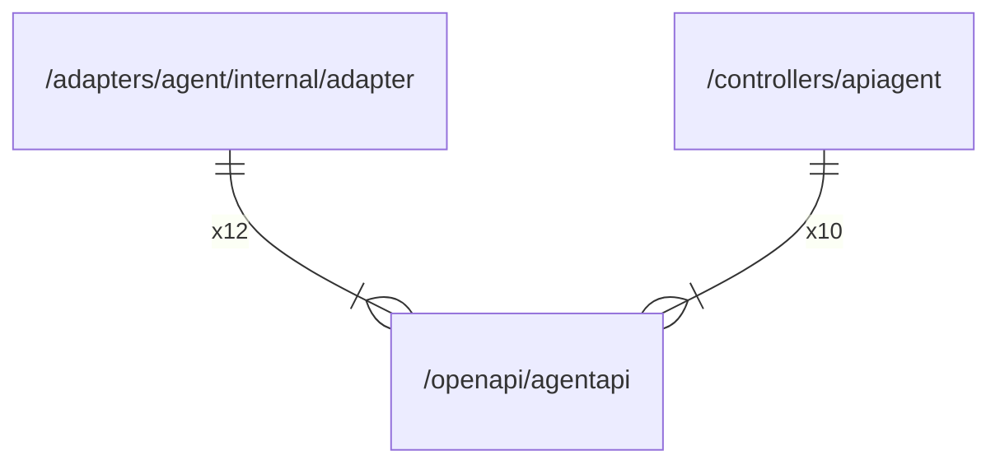

# agentapi

## Imports

### External imports

| Name       | Path                                     | Count |
|:-----------|:-----------------------------------------|------:|
| errors     | github.com/go-faster/errors              |    10 |
| http       | github.com/ogen-go/ogen/http             |     7 |
| ogenerrors | github.com/ogen-go/ogen/ogenerrors       |     7 |
| jx         | github.com/go-faster/jx                  |     5 |
| uri        | github.com/ogen-go/ogen/uri              |     5 |
| validate   | github.com/ogen-go/ogen/validate         |     5 |
| conv       | github.com/ogen-go/ogen/conv             |     4 |
| middleware | github.com/ogen-go/ogen/middleware       |     4 |
| attribute  | go.opentelemetry.io/otel/attribute       |     4 |
| trace      | go.opentelemetry.io/otel/trace           |     4 |
| uuid       | github.com/google/uuid                   |     3 |
| codes      | go.opentelemetry.io/otel/codes           |     3 |
| metric     | go.opentelemetry.io/otel/metric          |     3 |
| v1.37.0    | go.opentelemetry.io/otel/semconv/v1.37.0 |     2 |
| json       | github.com/ogen-go/ogen/json             |     1 |
| otelogen   | github.com/ogen-go/ogen/otelogen         |     1 |
| otel       | go.opentelemetry.io/otel                 |     1 |

### Std imports

| Name    | Path      | Count |
|:--------|:----------|------:|
| http    | net/http  |     9 |
| context | context   |     6 |
| url     | net/url   |     5 |
| io      | io        |     4 |
| strings | strings   |     4 |
| bytes   | bytes     |     3 |
| time    | time      |     3 |
| fmt     | fmt       |     2 |
| mime    | mime      |     2 |
| bits    | math/bits |     1 |
| strconv | strconv   |     1 |

## Used by

| Name     | Path                                                                      |
|:---------|:--------------------------------------------------------------------------|
| adapter  | [/adapters/agent/internal/adapter](../adapters/agent/internal/adapter.md) |
| apiagent | [/controllers/apiagent](../controllers/apiagent.md)                       |

## Scheme

---

> Generated by [goArchLint](https://github.com/gbh007/goarchlint)
