# serverapi

## Imports

|    Name    |                   Path                   | Inner | Count |
|:----------:|:----------------------------------------:|:-----:|:-----:|
|   errors   |       github.com/go-faster/errors        |  ❌   |  10   |
|    http    |                 net/http                 |  ❌   |   9   |
| ogenerrors |    github.com/ogen-go/ogen/ogenerrors    |  ❌   |   7   |
|  context   |                 context                  |  ❌   |   6   |
|    http    |       github.com/ogen-go/ogen/http       |  ❌   |   6   |
|     jx     |         github.com/go-faster/jx          |  ❌   |   5   |
|    uri     |       github.com/ogen-go/ogen/uri        |  ❌   |   5   |
|  validate  |     github.com/ogen-go/ogen/validate     |  ❌   |   5   |
|    url     |                 net/url                  |  ❌   |   5   |
|    conv    |       github.com/ogen-go/ogen/conv       |  ❌   |   4   |
| middleware |    github.com/ogen-go/ogen/middleware    |  ❌   |   4   |
|   trace    |      go.opentelemetry.io/otel/trace      |  ❌   |   4   |
|     io     |                    io                    |  ❌   |   4   |
|    time    |                   time                   |  ❌   |   4   |
|    uuid    |          github.com/google/uuid          |  ❌   |   3   |
| attribute  |    go.opentelemetry.io/otel/attribute    |  ❌   |   3   |
|   codes    |      go.opentelemetry.io/otel/codes      |  ❌   |   3   |
|   metric   |     go.opentelemetry.io/otel/metric      |  ❌   |   3   |
|  strings   |                 strings                  |  ❌   |   3   |
|   bytes    |                  bytes                   |  ❌   |   2   |
|  v1.26.0   | go.opentelemetry.io/otel/semconv/v1.26.0 |  ❌   |   2   |
|    mime    |                   mime                   |  ❌   |   2   |
|    fmt     |                   fmt                    |  ❌   |   1   |
|    json    |       github.com/ogen-go/ogen/json       |  ❌   |   1   |
|  otelogen  |     github.com/ogen-go/ogen/otelogen     |  ❌   |   1   |
|    otel    |         go.opentelemetry.io/otel         |  ❌   |   1   |
|    bits    |                math/bits                 |  ❌   |   1   |
|  strconv   |                 strconv                  |  ❌   |   1   |

## Used by

|        Name         |                                             Path                                              |
|:-------------------:|:---------------------------------------------------------------------------------------------:|
|      apiserver      |                     [/controllers/apiserver](../controllers/apiserver.md)                     |
|    agenthandlers    |       [/controllers/apiserver/agenthandlers](../controllers/apiserver/agenthandlers.md)       |
|    apiservercore    |       [/controllers/apiserver/apiservercore](../controllers/apiserver/apiservercore.md)       |
|  attributehandlers  |   [/controllers/apiserver/attributehandlers](../controllers/apiserver/attributehandlers.md)   |
|    bookhandlers     |        [/controllers/apiserver/bookhandlers](../controllers/apiserver/bookhandlers.md)        |
| deduplicatehandlers | [/controllers/apiserver/deduplicatehandlers](../controllers/apiserver/deduplicatehandlers.md) |
|     fshandlers      |          [/controllers/apiserver/fshandlers](../controllers/apiserver/fshandlers.md)          |
|   hproxyhandlers    |      [/controllers/apiserver/hproxyhandlers](../controllers/apiserver/hproxyhandlers.md)      |
|    labelhandlers    |       [/controllers/apiserver/labelhandlers](../controllers/apiserver/labelhandlers.md)       |
|  massloadhandlers   |    [/controllers/apiserver/massloadhandlers](../controllers/apiserver/massloadhandlers.md)    |
|   systemhandlers    |      [/controllers/apiserver/systemhandlers](../controllers/apiserver/systemhandlers.md)      |

## Scheme

```mermaid
erDiagram
    "/controllers/apiserver" ||--|{ "/openapi/serverapi" : x3
    "/controllers/apiserver/agenthandlers" ||--|{ "/openapi/serverapi" : x6
    "/controllers/apiserver/apiservercore" ||--|{ "/openapi/serverapi" : x3
    "/controllers/apiserver/attributehandlers" ||--|{ "/openapi/serverapi" : x12
    "/controllers/apiserver/bookhandlers" ||--|{ "/openapi/serverapi" : x10
    "/controllers/apiserver/deduplicatehandlers" ||--|{ "/openapi/serverapi" : x6
    "/controllers/apiserver/fshandlers" ||--|{ "/openapi/serverapi" : x11
    "/controllers/apiserver/hproxyhandlers" ||--|{ "/openapi/serverapi" : x4
    "/controllers/apiserver/labelhandlers" ||--|{ "/openapi/serverapi" : x8
    "/controllers/apiserver/massloadhandlers" ||--|{ "/openapi/serverapi" : x16
    "/controllers/apiserver/systemhandlers" ||--|{ "/openapi/serverapi" : x12
```

---

> Generated by [goArchLint](https://github.com/gbh007/goarchlint)
