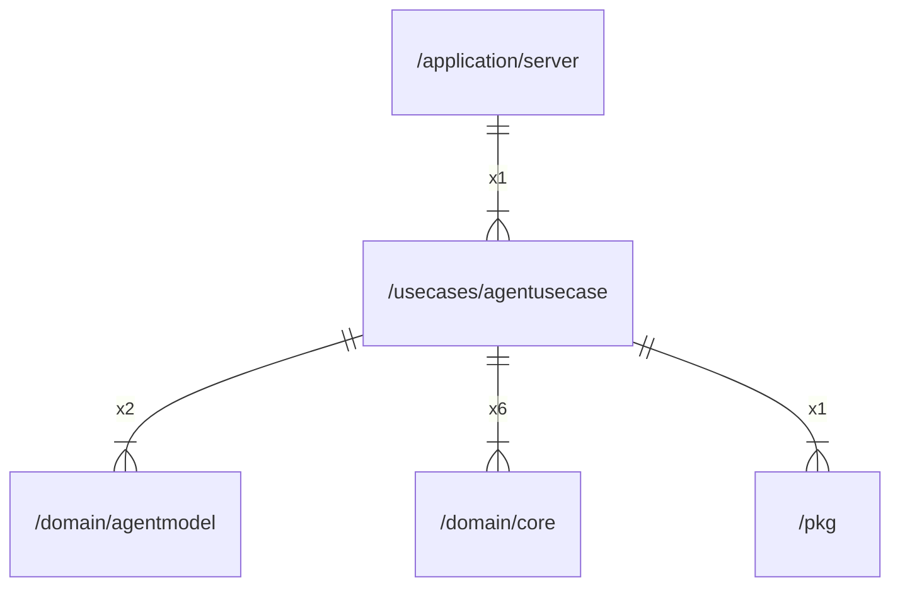

# agentusecase

## Imports

|    Name    |                     Path                      | Inner | Count |
|:----------:|:---------------------------------------------:|:-----:|:-----:|
|  context   |                    context                    |  ❌   |   6   |
|    core    |       [/domain/core](../domain/core.md)       |  ✅   |   6   |
|    fmt     |                      fmt                      |  ❌   |   5   |
|    uuid    |            github.com/google/uuid             |  ❌   |   4   |
|   errors   |                    errors                     |  ❌   |   2   |
| agentmodel | [/domain/agentmodel](../domain/agentmodel.md) |  ✅   |   2   |
|    pkg     |               [/pkg](../pkg.md)               |  ✅   |   1   |
|    slog    |                   log/slog                    |  ❌   |   1   |
|    time    |                     time                      |  ❌   |   1   |

## Used by

|  Name  |                      Path                       |
|:------:|:-----------------------------------------------:|
| server | [/application/server](../application/server.md) |

## Scheme

---

> Generated by [goArchLint](https://github.com/gbh007/goarchlint)
