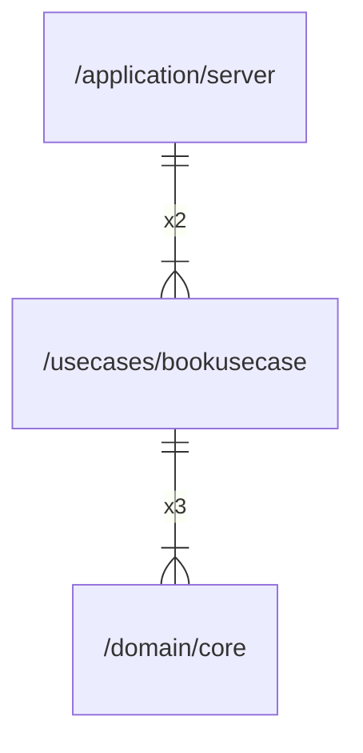

# bookusecase

## Imports

### Inner imports

| Name | Path                              | Count |
|:-----|:----------------------------------|------:|
| core | [/domain/core](../domain/core.md) |     3 |

### External imports

| Name | Path                   | Count |
|:-----|:-----------------------|------:|
| uuid | github.com/google/uuid |     5 |

### Std imports

| Name    | Path     | Count |
|:--------|:---------|------:|
| context | context  |     5 |
| time    | time     |     3 |
| fmt     | fmt      |     2 |
| slog    | log/slog |     1 |

## Used by

| Name   | Path                                            |
|:-------|:------------------------------------------------|
| server | [/application/server](../application/server.md) |

## Scheme

---

> Generated by [goArchLint](https://github.com/gbh007/goarchlint)
