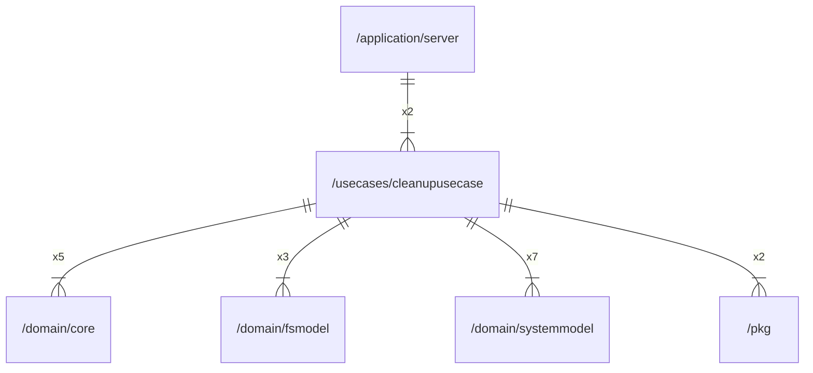

# cleanupusecase

## Imports

|    Name     |                      Path                       | Inner | Count |
|:-----------:|:-----------------------------------------------:|:-----:|:-----:|
|   context   |                     context                     |  ❌   |   8   |
| systemmodel | [/domain/systemmodel](../domain/systemmodel.md) |  ✅   |   7   |
|     fmt     |                       fmt                       |  ❌   |   6   |
|    core     |        [/domain/core](../domain/core.md)        |  ✅   |   5   |
|    uuid     |             github.com/google/uuid              |  ❌   |   4   |
|    trace    |         go.opentelemetry.io/otel/trace          |  ❌   |   4   |
|    slog     |                    log/slog                     |  ❌   |   4   |
|    time     |                      time                       |  ❌   |   4   |
|   fsmodel   |     [/domain/fsmodel](../domain/fsmodel.md)     |  ✅   |   3   |
|     pkg     |                [/pkg](../pkg.md)                |  ✅   |   2   |
|    bytes    |                      bytes                      |  ❌   |   1   |
|   slices    |                     slices                      |  ❌   |   1   |

## Used by

|  Name  |                      Path                       |
|:------:|:-----------------------------------------------:|
| server | [/application/server](../application/server.md) |

## Scheme

---

> Generated by [goArchLint](https://github.com/gbh007/goarchlint)
