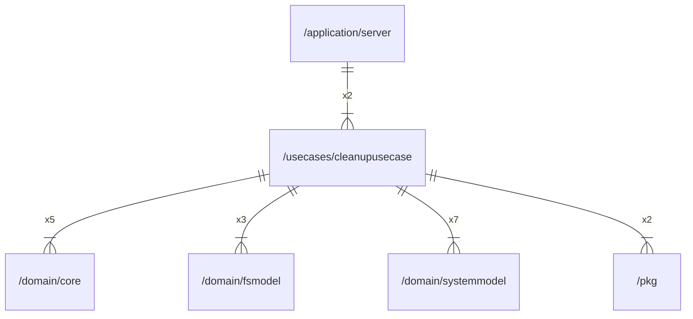

# cleanupusecase

## Imports

### Inner imports

| Name        | Path                                            | Count |
|:------------|:------------------------------------------------|------:|
| systemmodel | [/domain/systemmodel](../domain/systemmodel.md) |     7 |
| core        | [/domain/core](../domain/core.md)               |     5 |
| fsmodel     | [/domain/fsmodel](../domain/fsmodel.md)         |     3 |
| pkg         | [/pkg](../pkg.md)                               |     2 |

### External imports

| Name  | Path                           | Count |
|:------|:-------------------------------|------:|
| uuid  | github.com/google/uuid         |     4 |
| trace | go.opentelemetry.io/otel/trace |     4 |

### Std imports

| Name    | Path     | Count |
|:--------|:---------|------:|
| context | context  |     8 |
| fmt     | fmt      |     6 |
| slog    | log/slog |     4 |
| time    | time     |     4 |
| bytes   | bytes    |     1 |
| slices  | slices   |     1 |

## Used by

| Name   | Path                                            |
|:-------|:------------------------------------------------|
| server | [/application/server](../application/server.md) |

## Scheme

```mermaid
erDiagram
    "/application/server" ||--|{ "/usecases/cleanupusecase" : x2
    "/usecases/cleanupusecase" ||--|{ "/domain/core" : x5
    "/usecases/cleanupusecase" ||--|{ "/domain/fsmodel" : x3
    "/usecases/cleanupusecase" ||--|{ "/domain/systemmodel" : x7
    "/usecases/cleanupusecase" ||--|{ "/pkg" : x2
```

---

> Generated by [goArchLint](https://github.com/gbh007/goarchlint)
