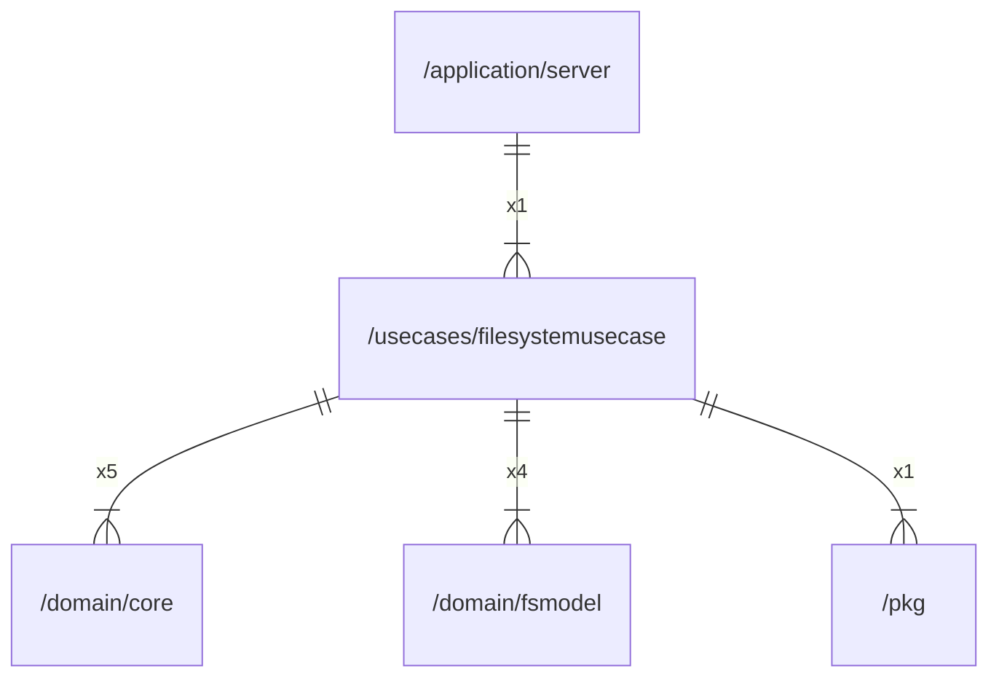

# filesystemusecase

## Imports

|  Name   |                  Path                   | Inner | Count |
|:-------:|:---------------------------------------:|:-----:|:-----:|
| context |                 context                 |  ❌   |   7   |
|  uuid   |         github.com/google/uuid          |  ❌   |   6   |
|   fmt   |                   fmt                   |  ❌   |   5   |
|  core   |    [/domain/core](../domain/core.md)    |  ✅   |   5   |
| fsmodel | [/domain/fsmodel](../domain/fsmodel.md) |  ✅   |   4   |
|   io    |                   io                    |  ❌   |   3   |
|  slog   |                log/slog                 |  ❌   |   2   |
| errors  |                 errors                  |  ❌   |   1   |
|   pkg   |            [/pkg](../pkg.md)            |  ✅   |   1   |
|   url   |                 net/url                 |  ❌   |   1   |
| slices  |                 slices                  |  ❌   |   1   |
|  time   |                  time                   |  ❌   |   1   |

## Used by

|  Name  |                      Path                       |
|:------:|:-----------------------------------------------:|
| server | [/application/server](../application/server.md) |

## Scheme

---

> Generated by [goArchLint](https://github.com/gbh007/goarchlint)
