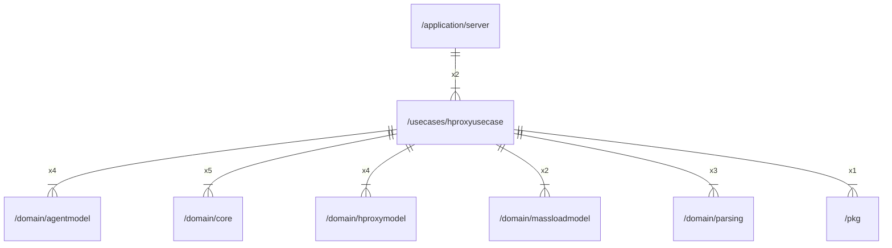

# hproxyusecase

## Imports

### Inner imports

| Name          | Path                                                | Count |
|:--------------|:----------------------------------------------------|------:|
| core          | [/domain/core](../domain/core.md)                   |     5 |
| agentmodel    | [/domain/agentmodel](../domain/agentmodel.md)       |     4 |
| hproxymodel   | [/domain/hproxymodel](../domain/hproxymodel.md)     |     4 |
| parsing       | [/domain/parsing](../domain/parsing.md)             |     3 |
| massloadmodel | [/domain/massloadmodel](../domain/massloadmodel.md) |     2 |
| pkg           | [/pkg](../pkg.md)                                   |     1 |

### External imports

| Name | Path                   | Count |
|:-----|:-----------------------|------:|
| uuid | github.com/google/uuid |     1 |

### Std imports

| Name    | Path     | Count |
|:--------|:---------|------:|
| context | context  |     5 |
| fmt     | fmt      |     5 |
| errors  | errors   |     4 |
| slog    | log/slog |     4 |
| url     | net/url  |     4 |
| io      | io       |     2 |
| slices  | slices   |     1 |
| time    | time     |     1 |

## Used by

| Name   | Path                                            |
|:-------|:------------------------------------------------|
| server | [/application/server](../application/server.md) |

## Scheme

```mermaid
erDiagram
    "/application/server" ||--|{ "/usecases/hproxyusecase" : x2
    "/usecases/hproxyusecase" ||--|{ "/domain/agentmodel" : x4
    "/usecases/hproxyusecase" ||--|{ "/domain/core" : x5
    "/usecases/hproxyusecase" ||--|{ "/domain/hproxymodel" : x4
    "/usecases/hproxyusecase" ||--|{ "/domain/massloadmodel" : x2
    "/usecases/hproxyusecase" ||--|{ "/domain/parsing" : x3
    "/usecases/hproxyusecase" ||--|{ "/pkg" : x1
```

---

> Generated by [goArchLint](https://github.com/gbh007/goarchlint)
