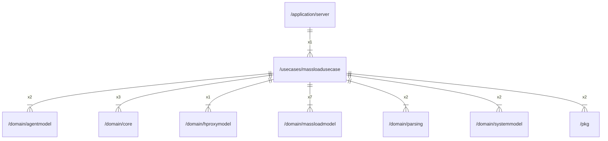

# massloadusecase

## Imports

|     Name      |                        Path                         | Inner | Count |
|:-------------:|:---------------------------------------------------:|:-----:|:-----:|
|    context    |                       context                       |  ❌   |   8   |
|      fmt      |                         fmt                         |  ❌   |   7   |
| massloadmodel | [/domain/massloadmodel](../domain/massloadmodel.md) |  ✅   |   7   |
|     time      |                        time                         |  ❌   |   6   |
|     core      |          [/domain/core](../domain/core.md)          |  ✅   |   3   |
|      url      |                       net/url                       |  ❌   |   3   |
|  agentmodel   |    [/domain/agentmodel](../domain/agentmodel.md)    |  ✅   |   2   |
|    parsing    |       [/domain/parsing](../domain/parsing.md)       |  ✅   |   2   |
|  systemmodel  |   [/domain/systemmodel](../domain/systemmodel.md)   |  ✅   |   2   |
|      pkg      |                  [/pkg](../pkg.md)                  |  ✅   |   2   |
|     uuid      |               github.com/google/uuid                |  ❌   |   2   |
|     slog      |                      log/slog                       |  ❌   |   2   |
|    errors     |                       errors                        |  ❌   |   1   |
|  hproxymodel  |   [/domain/hproxymodel](../domain/hproxymodel.md)   |  ✅   |   1   |

## Used by

|  Name  |                      Path                       |
|:------:|:-----------------------------------------------:|
| server | [/application/server](../application/server.md) |

## Scheme

---

> Generated by [goArchLint](https://github.com/gbh007/goarchlint)
