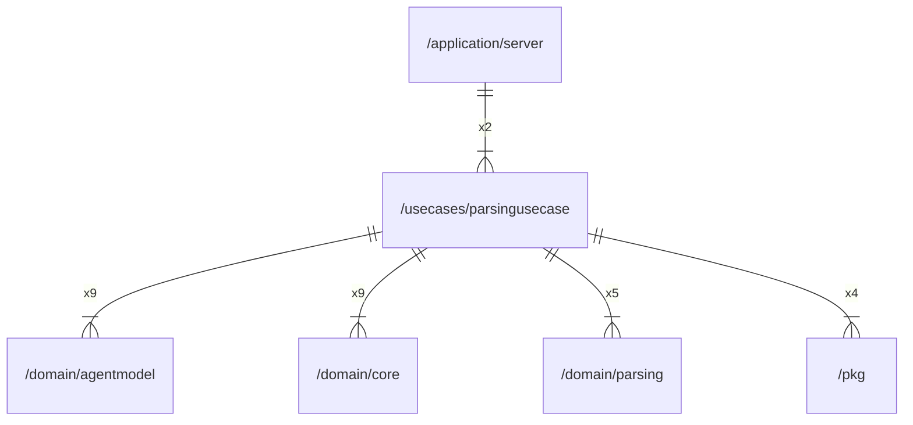

# parsingusecase

## Imports

### Inner imports

| Name       | Path                                          | Count |
|:-----------|:----------------------------------------------|------:|
| agentmodel | [/domain/agentmodel](../domain/agentmodel.md) |     9 |
| core       | [/domain/core](../domain/core.md)             |     9 |
| parsing    | [/domain/parsing](../domain/parsing.md)       |     5 |
| pkg        | [/pkg](../pkg.md)                             |     4 |

### External imports

| Name | Path                   | Count |
|:-----|:-----------------------|------:|
| uuid | github.com/google/uuid |     7 |

### Std imports

| Name    | Path     | Count |
|:--------|:---------|------:|
| context | context  |    12 |
| fmt     | fmt      |    10 |
| url     | net/url  |     7 |
| errors  | errors   |     6 |
| slog    | log/slog |     5 |
| time    | time     |     5 |
| io      | io       |     2 |
| path    | path     |     1 |
| strings | strings  |     1 |

## Used by

| Name   | Path                                            |
|:-------|:------------------------------------------------|
| server | [/application/server](../application/server.md) |

## Scheme

```mermaid
erDiagram
    "/application/server" ||--|{ "/usecases/parsingusecase" : x2
    "/usecases/parsingusecase" ||--|{ "/domain/agentmodel" : x9
    "/usecases/parsingusecase" ||--|{ "/domain/core" : x9
    "/usecases/parsingusecase" ||--|{ "/domain/parsing" : x5
    "/usecases/parsingusecase" ||--|{ "/pkg" : x4
```

---

> Generated by [goArchLint](https://github.com/gbh007/goarchlint)
