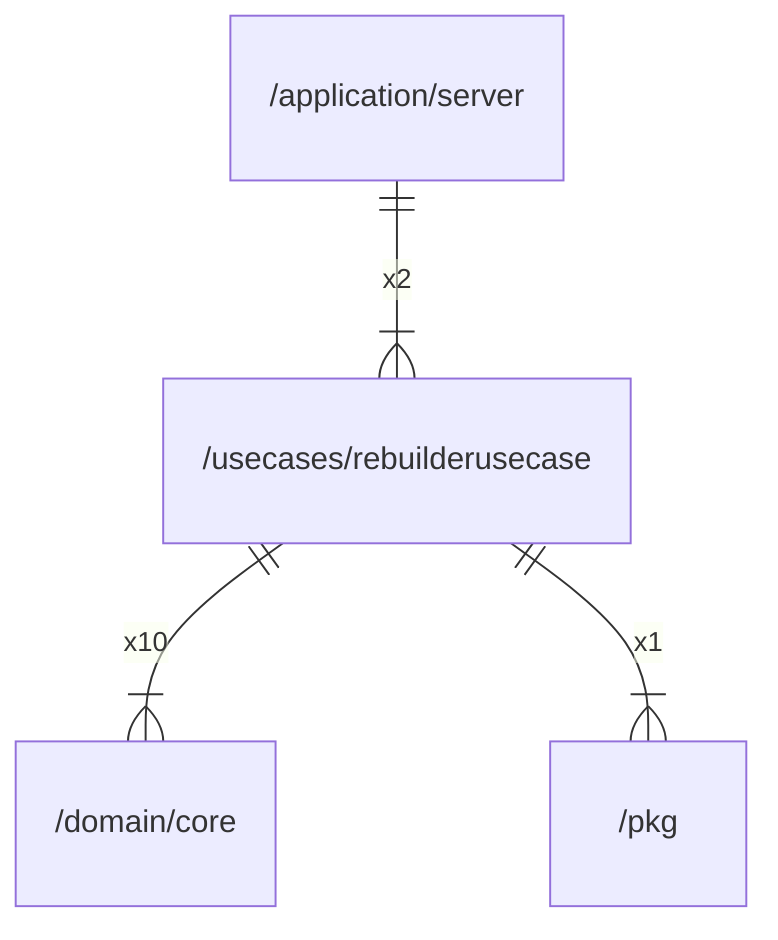

# rebuilderusecase

## Imports

|  Name   |               Path                | Inner | Count |
|:-------:|:---------------------------------:|:-----:|:-----:|
| context |              context              |  ❌   |  10   |
|  core   | [/domain/core](../domain/core.md) |  ✅   |  10   |
|   fmt   |                fmt                |  ❌   |   8   |
|  uuid   |      github.com/google/uuid       |  ❌   |   6   |
|  time   |               time                |  ❌   |   4   |
|  slog   |             log/slog              |  ❌   |   2   |
| slices  |              slices               |  ❌   |   2   |
|   pkg   |         [/pkg](../pkg.md)         |  ✅   |   1   |
|  trace  |  go.opentelemetry.io/otel/trace   |  ❌   |   1   |
|  maps   |               maps                |  ❌   |   1   |

## Used by

|  Name  |                      Path                       |
|:------:|:-----------------------------------------------:|
| server | [/application/server](../application/server.md) |

## Scheme

---

> Generated by [goArchLint](https://github.com/gbh007/goarchlint)
