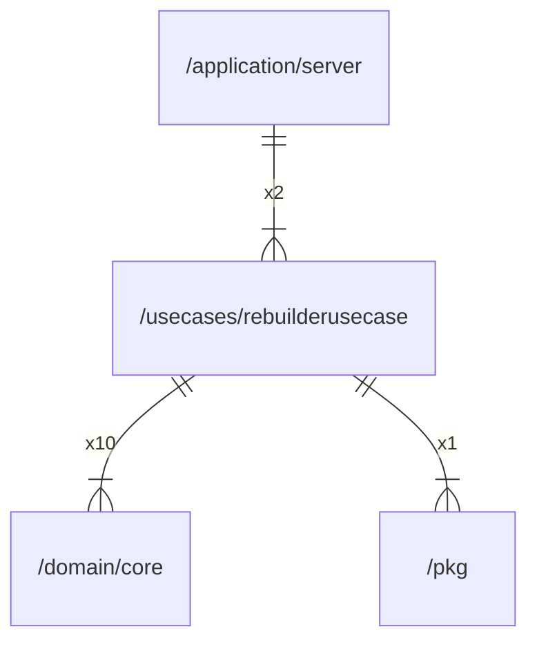

# rebuilderusecase

## Imports

### Inner imports

| Name | Path                              | Count |
|:-----|:----------------------------------|------:|
| core | [/domain/core](../domain/core.md) |    10 |
| pkg  | [/pkg](../pkg.md)                 |     1 |

### External imports

| Name  | Path                           | Count |
|:------|:-------------------------------|------:|
| uuid  | github.com/google/uuid         |     6 |
| trace | go.opentelemetry.io/otel/trace |     1 |

### Std imports

| Name    | Path     | Count |
|:--------|:---------|------:|
| context | context  |    10 |
| fmt     | fmt      |     8 |
| time    | time     |     4 |
| slog    | log/slog |     2 |
| slices  | slices   |     2 |
| maps    | maps     |     1 |

## Used by

| Name   | Path                                            |
|:-------|:------------------------------------------------|
| server | [/application/server](../application/server.md) |

## Scheme

```mermaid
erDiagram
    "/application/server" ||--|{ "/usecases/rebuilderusecase" : x2
    "/usecases/rebuilderusecase" ||--|{ "/domain/core" : x10
    "/usecases/rebuilderusecase" ||--|{ "/pkg" : x1
```

---

> Generated by [goArchLint](https://github.com/gbh007/goarchlint)
