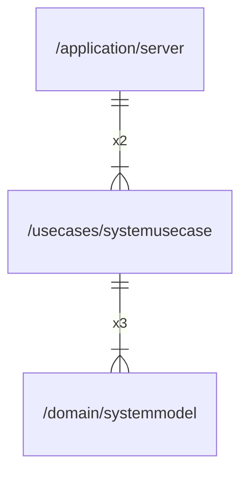

# systemusecase

## Imports

### Inner imports

| Name        | Path                                            | Count |
|:------------|:------------------------------------------------|------:|
| systemmodel | [/domain/systemmodel](../domain/systemmodel.md) |     3 |

### External imports

| Name | Path                   | Count |
|:-----|:-----------------------|------:|
| uuid | github.com/google/uuid |     2 |

### Std imports

| Name    | Path     | Count |
|:--------|:---------|------:|
| context | context  |     4 |
| fmt     | fmt      |     2 |
| slog    | log/slog |     1 |

## Used by

| Name   | Path                                            |
|:-------|:------------------------------------------------|
| server | [/application/server](../application/server.md) |

## Scheme

```mermaid
erDiagram
    "/application/server" ||--|{ "/usecases/systemusecase" : x2
    "/usecases/systemusecase" ||--|{ "/domain/systemmodel" : x3
```

---

> Generated by [goArchLint](https://github.com/gbh007/goarchlint)
